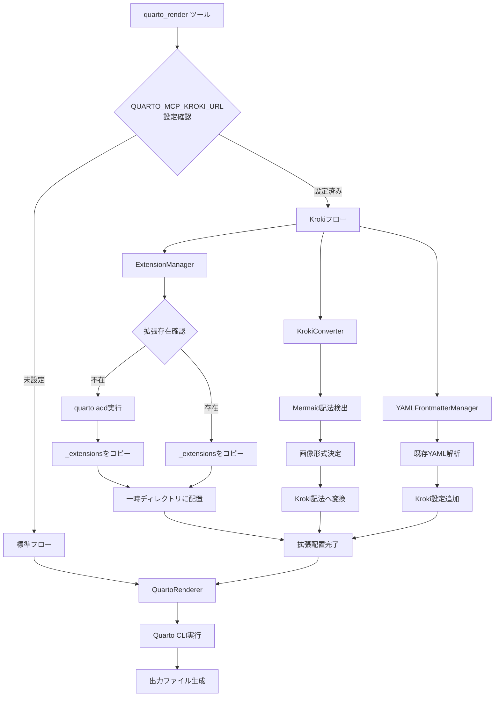
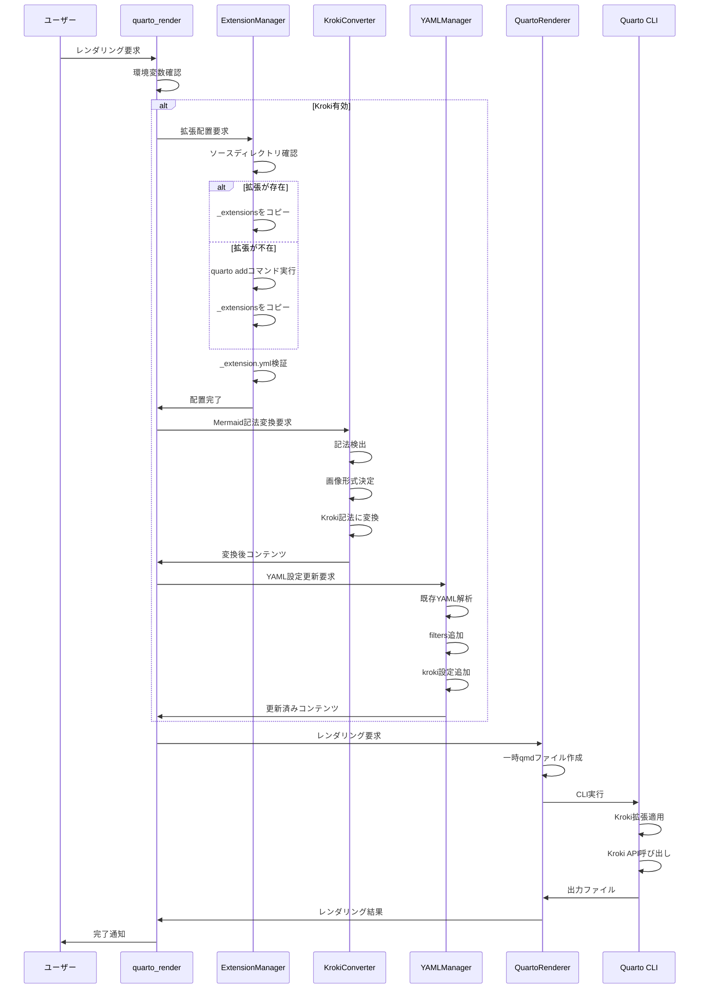
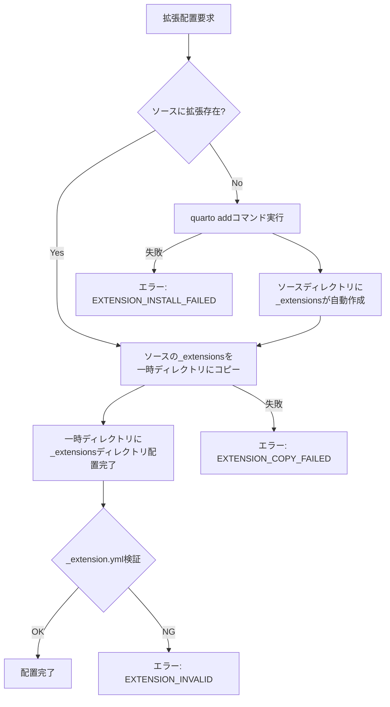
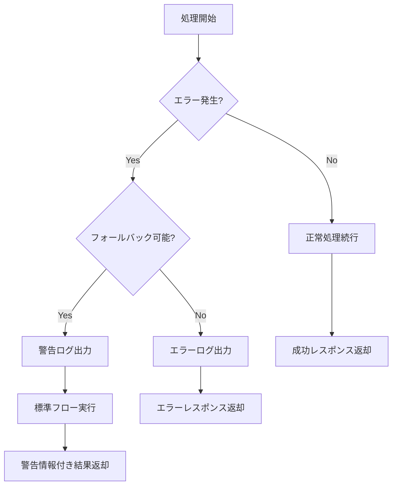

# Kroki統合によるMermaid高速レンダリング機能 設計書

## 1. 概要

### 1.1 目的

Quarto標準のMermaidレンダリングは各ダイアグラムごとにChromiumブラウザを起動するため、特にPowerPoint出力時に処理時間が長くなる。本機能は、Krokiサービスを利用してMermaidダイアグラムをHTTP API経由でレンダリングすることで、Chromium起動のオーバーヘッドを排除し、レンダリング時間を大幅に短縮する。

### 1.2 背景

#### 現在の問題点

- 複数のMermaidダイアグラムがある場合、各ダイアグラムごとにChromiumプロセスを起動・終了するため時間がかかる
- ダイアグラムが順次処理されるため並列化が困難
- Chromiumの起動には数秒を要し、3つのダイアグラムで合計10〜15秒かかる場合がある

#### 処理時間の比較

- Quarto標準（Chromium使用）: 約10〜15秒（3ダイアグラムの場合）
- Kroki HTTP API使用: 約2〜3秒（3ダイアグラムの場合）

### 1.3 Krokiについて

Krokiは様々なダイアグラム記法をHTTP API経由でSVGやPNG画像に変換するオープンソースのサービスである。

**主要な特徴:**
- HTTP APIによる画像生成
- Chromiumを使用するが、サービス側で永続的なインスタンスを管理
- SVG、PNG、PDFなど複数の出力形式をサポート
- 公開サービス（kroki.io）またはセルフホスティングが可能
- Mermaid、PlantUML、Graphviz、Ditaaなど多数のダイアグラムタイプをサポート

### 1.4 解決方針

quarto-kroki拡張を使用してQuarto自体にKrokiを使わせることで、以下を実現する：

- ユーザーは標準のMermaid記法を使用
- サーバー側でquarto-kroki拡張を自動的に適用
- Mermaid記法を保持したままKrokiでレンダリング
- 環境変数による有効化・無効化の制御

## 2. 機能要件

### 2.1 環境変数による制御

#### QUARTO_MCP_KROKI_URL

KrokiサービスのエンドポイントURLを指定する環境変数。

**動作:**
- 未設定の場合: Kroki機能は無効、標準のMermaidレンダリングを使用
- 設定されている場合: Kroki機能を有効化し、指定されたURLのKrokiサービスを使用

**設定例:**
- ローカルサービス利用時: 値を `http://kroki:8000` に設定

#### その他の環境変数

**QUARTO_MCP_KROKI_TIMEOUT:**
- KrokiへのHTTPリクエストのタイムアウト秒数を指定
- デフォルト値: 3600秒
- 用途: ネットワーク接続が遅い環境での調整

**QUARTO_MCP_KROKI_IMAGE_FORMAT:**
- 画像形式の指定
- 許可値: `auto`、`svg`、`png`
- デフォルト値: `auto`（出力形式に応じて自動選択）
- 重要: `svg`または`png`が指定された場合、全ての出力形式でその画像形式を使用

**QUARTO_MCP_EXTENSIONS_SOURCE:**
- quarto-kroki拡張を含む`_extensions`ディレクトリのパスを指定
- デフォルト値: `/opt/quarto-project/_extensions`
- 動作:
  - 指定されたパスが存在し、その中に`quarto-ext/kroki/_extension.yml`がある場合、そこから拡張をコピー
  - 存在しない場合、親ディレクトリで`quarto add quarto-ext/kroki`コマンドを実行して拡張を取得
  - レンダリング時、.qmdファイルと同じディレクトリに`_extensions`ディレクトリ全体をコピー
- 用途: 拡張のキャッシュ管理、複数拡張の一括管理、オフライン環境での利用

### 2.2 quarto-kroki拡張の利用

#### 自動配置機能

quarto-kroki拡張は、quarto-ext/krokiの仕様により、.qmdファイルと同じディレクトリに`_extensions/quarto-ext/kroki`として存在する必要がある。本システムは、レンダリング時に自動的に拡張を配置する機能を提供する。

**使用する拡張:**
- GitHub リポジトリ: quarto-ext/kroki
- 選定理由: SVG/PNG形式の指定が可能で、カスタムサービスURLの指定に対応している

**自動配置の動作:**

1. **拡張の取得元確認:**
   - `QUARTO_MCP_EXTENSIONS_SOURCE`環境変数で指定されたパスを確認
   - デフォルト: `/opt/quarto-project/_extensions`
   - 指定されたパスの`quarto-ext/kroki/_extension.yml`が存在するか確認

2. **拡張が存在する場合:**
   - `QUARTO_MCP_EXTENSIONS_SOURCE`ディレクトリ全体を一時ディレクトリの`_extensions`にコピー
   - 既存の拡張をそのまま使用（ネットワークアクセス不要）

3. **拡張が存在しない場合:**
   - `QUARTO_MCP_EXTENSIONS_SOURCE`の親ディレクトリ（デフォルト: `/opt/quarto-project`）に移動
   - `quarto add quarto-ext/kroki --no-prompt`コマンドを実行
   - Quartoが`_extensions/quarto-ext/kroki`として拡張を自動配置
   - 作成された`_extensions`ディレクトリ全体を一時ディレクトリにコピー

4. **レンダリング時の配置:**
   - Quarto CLIを実行する前に、一時.qmdファイルと同じディレクトリに`_extensions`ディレクトリをコピー
   - `_extensions/quarto-ext/kroki/_extension.yml`の存在を検証
   - 配置に失敗した場合はエラーを返す

#### 手動での事前準備（オプション）

初回インストールを事前に実行したい場合や、特定のバージョンを使用したい場合は、以下の方法で事前に拡張を配置できる。

**方法1: 推奨方法（Quarto CLIによるインストール）**

```bash
# ソースディレクトリを作成
mkdir -p /opt/quarto-project
cd /opt/quarto-project

# Quarto CLIで拡張をインストール
quarto add quarto-ext/kroki --no-prompt

# _extensions/quarto-ext/kroki ディレクトリが作成される
ls _extensions/quarto-ext/kroki/_extension.yml  # 確認
```

**方法2: 既存プロジェクトからコピー**

```bash
# 既存のQuartoプロジェクトから_extensionsディレクトリをコピー
mkdir -p /opt/quarto-project
cp -r /path/to/existing/project/_extensions /opt/quarto-project/
```

**方法3: カスタムパスの指定**

プロジェクト固有の拡張ディレクトリを使用する場合：

```bash
# プロジェクトディレクトリに拡張をインストール
cd /path/to/your/project
quarto add quarto-ext/kroki --no-prompt

# 環境変数で_extensionsディレクトリのパスを指定
export QUARTO_MCP_EXTENSIONS_SOURCE=/path/to/your/project/_extensions
```

#### Krokiサービスの起動

Krokiサービスをセルフホスティングする場合、Docker Composeを使用して簡単に起動できる。

**docker-compose.ymlの例:**

```yaml
services:
  kroki:
    image: yuzutech/kroki:latest
    container_name: kroki
    ports:
      - "8000:8000"
    environment:
      - KROKI_MERMAID_HOST=mermaid
    depends_on:
      - mermaid
      - blockdiag
      - excalidraw
    restart: unless-stopped

  mermaid:
    image: yuzutech/kroki-mermaid:latest
    container_name: kroki-mermaid
    expose:
      - "8002"
    restart: unless-stopped
```

**起動方法:**

```bash
# Krokiサービスを起動
docker-compose up -d

# サービスの状態を確認
docker-compose ps

# ログを確認
docker-compose logs -f kroki
```

**環境変数の設定:**

Krokiサービス起動後、環境変数を設定してKroki機能を有効化：

```bash
# ローカルのKrokiサービスを使用
export QUARTO_MCP_KROKI_URL=http://kroki:8000

# タイムアウトを調整（オプション）
export QUARTO_MCP_KROKI_TIMEOUT=3600

# 画像形式を指定（オプション）
export QUARTO_MCP_KROKI_IMAGE_FORMAT=auto

# 拡張のソースディレクトリを指定（オプション）
export QUARTO_MCP_EXTENSIONS_SOURCE=~/.quarto_mcp/extensions
```

**拡張の配置と適用:**
- Kroki機能が有効な場合、レンダリング前に自動的に拡張を配置
- YAMLフロントマターに拡張を自動的に追加
- 拡張の取得または配置に失敗した場合はエラーを返す

### 2.3 Mermaid記法の処理

#### ユーザー記法

ユーザーは標準のMermaid記法をそのまま使用可能。

**対象となる記法:**
- Quarto拡張記法: 波括弧で囲まれたmermaid指定を持つコードブロック
- 標準Markdown記法: 言語指定としてmermaidを持つコードブロック

**処理方針:**
- サーバー側で標準Mermaid記法をKroki記法に自動変換
- ダイアグラムコード本体は変更せず保持
- quarto-kroki拡張がKroki記法を解釈してKroki API経由でレンダリング

### 2.4 YAMLフロントマターの設定

#### 追加する設定項目

Quarto Markdownに以下の設定を追加または更新する。

**filtersキー:**
- kroki要素を配列に追加
- 既存のfilters配列がある場合は要素を追加
- filters配列が存在しない場合は新規作成

**krokiキー:**
- serviceUrl サブキーに環境変数で指定されたKrokiサービスURLを設定
- 既存のkrokiキーがある場合はserviceUrlを上書き

#### マージ処理

既存のYAMLフロントマターが存在する場合のマージルール：

1. 既存のYAMLヘッダーを解析して辞書形式で取得
2. filtersキーを確認し、kroki要素が含まれていない場合のみ追加
3. krokiキーを確認し、serviceUrlを設定または上書き
4. その他の既存キーと値はすべて保持
5. マージ結果をYAML形式で出力

### 2.5 画像形式の選択

#### 選択ロジック

画像形式は以下の優先順位で決定される。

**1. 環境変数による指定（最優先）:**

`QUARTO_MCP_KROKI_IMAGE_FORMAT`環境変数が`svg`または`png`に設定されている場合：
- 全ての出力形式で指定された画像形式を使用
- 出力形式に関わらず、常にこの形式を適用

**2. 出力形式に応じた自動選択（環境変数がautoまたは未設定の場合）:**

出力形式に応じて、最適な画像形式を自動的に選択する。

- **PowerPoint（pptx）**: PNG形式（SVGの直接埋め込み非サポート）
- **Word（docx）**: PNG形式（SVGの埋め込みに制限）
- **PDF**: PNG形式（LaTeX経由のSVG変換に追加ツールが必要）
- **HTML（html、revealjs）**: SVG形式（完全なSVGサポート、スケーラブル）
- **その他**: PNG形式（デフォルト）

### 2.6 Kroki記法への変換

#### 変換の必要性

quarto-kroki拡張は、kroki-mermaid記法を解釈してKroki APIを呼び出す。標準のmermaid記法をkroki-mermaid記法に変換する必要がある。

#### 変換処理の詳細

**Quarto拡張記法の変換:**
- 波括弧で囲まれたmermaid指定を検出
- 指定をkroki-mermaidまたはkroki-mermaid-形式名に置き換え
- ダイアグラムコード本体は変更せずそのまま保持
- セルオプション（パーセント記号2つと縦棒で始まる行）がある場合は保持

**標準Markdown記法の変換:**
- 言語指定としてmermaidが指定されているコードブロックを検出
- 波括弧付きのkroki-mermaidまたはkroki-mermaid-形式名に変換
- ダイアグラムコード本体は変更せずそのまま保持

**画像形式の付与:**
- SVG形式を選択した場合: kroki-mermaid-svg に変換
- PNG形式を選択した場合: kroki-mermaid-png に変換
- 形式指定なしの場合: kroki-mermaid に変換（拡張のデフォルト形式を使用）

## 3. システムアーキテクチャ

### 3.1 コンポーネント構成



### 3.2 処理フロー

#### 全体フロー



#### 詳細処理ステップ

**ステップ1: 環境変数確認**
1. QUARTO_MCP_KROKI_URLの存在を確認
2. URL形式の妥当性を検証（httpまたはhttpsで始まるか）
3. 未設定または不正な場合は標準フローへ分岐
4. 正常な場合はKrokiフローへ進む

**ステップ2: 拡張の配置**
1. 環境変数`QUARTO_MCP_EXTENSIONS_SOURCE`からソースディレクトリのパスを取得（デフォルト: `/opt/quarto-project/_extensions`）
2. ソースディレクトリに`quarto-ext/kroki/_extension.yml`が存在するか確認
3. 存在する場合はソースディレクトリから`_extensions`全体をコピー
4. 存在しない場合は以下の処理を実行:
   - 親ディレクトリ（デフォルト: `/opt/quarto-project`）で`quarto add quarto-ext/kroki --no-prompt`を実行
   - ソースディレクトリに`_extensions/quarto-ext/kroki`が自動作成される
5. 一時ディレクトリに`_extensions`ディレクトリ全体を配置
6. `_extensions/quarto-ext/kroki/_extension.yml`の存在を検証
7. 検証に失敗した場合はエラーを返す

**ステップ3: Mermaid記法の変換**
1. 入力コンテンツを行単位で解析
2. Quarto拡張記法のパターンをマッチング
3. 標準Markdown記法のパターンをマッチング
4. 各Mermaidコードブロックの位置情報を記録
5. 環境変数または出力形式に基づいて画像形式を決定
6. 各コードブロックの言語指定をkroki-mermaidに置き換え
7. 画像形式が指定されている場合はハイフンと形式名を付与
8. 変換後のコンテンツを生成

**ステップ4: YAMLフロントマターの更新**
1. 変換後のコンテンツから既存のYAMLヘッダーを抽出
2. YAMLヘッダーが存在する場合はパース
3. filtersキーの有無を確認
4. filtersが配列でない場合は配列に変換
5. kroki要素が含まれていない場合のみ追加
6. krokiキーを作成または更新
7. serviceUrlサブキーに環境変数の値を設定
8. マージされたYAMLと本文を結合

**ステップ5: Quarto CLIの実行**
1. 変換後のコンテンツを一時qmdファイルとして保存
**ステップ5: Quarto CLIの実行**
1. 変換後のコンテンツを一時qmdファイルとして保存
2. 一時ディレクトリをカレントディレクトリとして設定
3. Quarto CLI renderコマンドを構築
4. 出力形式、出力ファイル名などのオプションを指定
5. Quarto CLIを非同期で実行
6. 標準出力と標準エラー出力をキャプチャ
7. プロセスの終了を待機
8. 一時ディレクトリ内の出力ファイルを最終出力先にコピー

**ステップ6: クリーンアップ**
1. 一時ディレクトリとそのすべての内容を削除
2. エラーが発生した場合でもクリーンアップを確実に実行

## 4. コンポーネント詳細設計

### 4.1 KrokiConverterクラス

#### 責務

Quarto MardownコンテンツのMermaid記法をKroki記法に変換する。

#### 初期化処理

パラメータとして以下を受け取る：
- KrokiサービスURL
- 出力形式ID
- 画像形式設定（autoまたは具体的な形式）

初期化時に以下を実行：
- 出力形式に基づいて画像形式を決定
- 内部状態の初期化

#### 主要メソッド

**変換メソッド:**
- 入力: Quarto Markdownコンテンツ文字列
- 出力: 変換後のQuarto Markdownコンテンツ文字列
- 処理: Mermaid記法の検出、Kroki記法への変換、コンテンツの再構築

**画像形式決定メソッド:**
- 入力: 出力形式ID
- 出力: 画像形式文字列（svgまたはpng）
- 処理: 出力形式に基づいた画像形式の選択ロジック適用

**Mermaid記法検出メソッド:**
- 入力: コンテンツ文字列
- 出力: Mermaidコードブロック情報のリスト（開始行、終了行、記法タイプ）
- 処理: 正規表現パターンマッチングによる検出

**記法変換メソッド:**
- 入力: 元のコードブロックマーカー文字列、画像形式
- 出力: 変換後のコードブロックマーカー文字列
- 処理: kroki-mermaid記法への文字列変換

### 4.2 YAMLFrontmatterManagerクラス

#### 責務

YAMLフロントマターへのKroki設定の追加と既存YAMLとのマージを管理する。

#### 主要メソッド

**YAML更新メソッド:**
- 入力: コンテンツ文字列、KrokiサービスURL
- 出力: 更新されたコンテンツ文字列
- 処理: 既存YAMLの抽出、マージ、コンテンツへの再統合

**YAML抽出メソッド:**
- 入力: コンテンツ文字列
- 出力: YAML辞書と本文のタプル
- 処理: 正規表現によるYAMLヘッダーの抽出とパース

**YAMLマージメソッド:**
- 入力: 既存YAML辞書、KrokiサービスURL
- 出力: マージされたYAML辞書
- 処理: filtersとkrokiキーの追加・更新

**YAML再構築メソッド:**
- 入力: YAML辞書、本文文字列
- 出力: YAMLヘッダーと本文を結合したコンテンツ文字列
- 処理: YAML辞書の文字列化とデリミターの追加

### 4.3 QuartoRendererクラスの拡張

#### 追加メソッド

**Kroki有効判定メソッド:**
- 入力: なし
- 出力: Kroki有効の真偽値
- 処理: 環境変数の存在確認とURL検証

**Kroki変換統合メソッド:**
- 入力: 元のコンテンツ、出力形式
- 出力: 変換後のコンテンツ
- 処理: KrokiConverterとYAMLFrontmatterManagerの呼び出し

**エラーハンドリングメソッド:**
- 入力: エラー情報
- 出力: フォールバック実行の真偽値
- 処理: エラーログ記録と標準フローへのフォールバック判定

#### render メソッドの変更

既存のrenderメソッドに以下の処理を追加：

1. Kroki有効判定の実行
2. Kroki有効な場合は拡張配置とKroki変換統合メソッドの呼び出し
3. 変換エラー時のフォールバック処理
4. 警告情報の記録

### 4.4 ExtensionManagerクラス

#### 責務

quarto-kroki拡張の取得、保存、配置を管理する。

#### 初期化処理

パラメータとして以下を受け取る：
- 拡張ソースディレクトリのパス（オプション、デフォルト: `/opt/quarto-project/_extensions`）

初期化時に以下を実行：
- ソースディレクトリのパスを正規化（チルダ展開）
- ソースディレクトリが存在しない場合は作成

#### 主要メソッド

**拡張配置メソッド:**
- 入力: 配置先ディレクトリパス（一時ディレクトリ）
- 出力: なし（エラー時に例外を発生）
- 処理: 
  1. `QUARTO_MCP_EXTENSIONS_SOURCE`の`quarto-ext/kroki/_extension.yml`が存在するか確認
  2. 存在する場合は`QUARTO_MCP_EXTENSIONS_SOURCE`ディレクトリ全体をコピー処理へ
  3. 存在しない場合はQuarto addコマンドを実行後、作成された`_extensions`をコピー処理へ
  4. 配置先の`_extensions/quarto-ext/kroki/_extension.yml`を検証

**拡張存在確認メソッド:**
- 入力: なし
- 出力: 拡張が存在するかの真偽値
- 処理: `QUARTO_MCP_EXTENSIONS_SOURCE`の`quarto-ext/kroki/_extension.yml`の存在確認

**拡張インストールメソッド:**
- 入力: なし
- 出力: なし（エラー時に例外を発生）
- 処理: 
  1. `QUARTO_MCP_EXTENSIONS_SOURCE`の親ディレクトリ（デフォルト: `/opt/quarto-project`）に移動
  2. `quarto add quarto-ext/kroki --no-prompt`コマンドを実行
  3. コマンドの標準出力・標準エラーをキャプチャ
  4. 終了コードが0でない場合は例外を発生
  5. `_extensions/quarto-ext/kroki/_extension.yml`の存在を確認

**拡張コピーメソッド:**
- 入力: 配置先ディレクトリパス
- 出力: なし（エラー時に例外を発生）
- 処理: 
  1. `QUARTO_MCP_EXTENSIONS_SOURCE`ディレクトリ全体を配置先の`_extensions`にコピー
  2. シンボリックリンクは実体ファイルとしてコピー
  3. 既存の`_extensions`ディレクトリがある場合は上書き

**拡張検証メソッド:**
- 入力: 配置先ディレクトリパス
- 出力: 検証結果の真偽値
- 処理: 
  1. `_extensions/quarto-ext/kroki/_extension.yml`の存在確認
  2. YAMLファイルのパース
  3. 必須キー（name、author、version）の存在確認

#### エラーハンドリング

**Quartoコマンド実行失敗:**
- Quarto CLIが見つからない場合
- ネットワークエラー、拡張が見つからないなどのエラーを捕捉
- 標準エラー出力をエラーメッセージに含める
- 例外を発生させてレンダリングを中止

**コピー失敗:**
- ファイルシステムエラーを捕捉
- パーミッションエラーの場合は詳細を記録
- 例外を発生させてレンダリングを中止

**検証失敗:**
- `_extension.yml`が不正な場合
- エラーメッセージに詳細を含める
- 例外を発生させてレンダリングを中止

## 5. エラーハンドリング

### 5.1 エラーケースと対処

| エラーケース | 検出方法 | 対処 | エラーコード |
|------------|---------|------|------------|
| Kroki URLが不正 | URL検証 | 警告ログ出力、標準フローへフォールバック | KROKI_INVALID_URL |
| 拡張が存在せずquarto add失敗 | Quarto CLIエラー、ネットワークエラー | エラー詳細をユーザーへ返す、レンダリング中止 | EXTENSION_INSTALL_FAILED |
| 拡張のコピー失敗 | ファイルシステムエラー | エラー詳細をユーザーへ返す、レンダリング中止 | EXTENSION_COPY_FAILED |
| 拡張の検証失敗 | _extension.yml不在または不正 | エラー詳細をユーザーへ返す、レンダリング中止 | EXTENSION_INVALID |
| Kroki API接続失敗 | Quartoエラー出力解析 | エラー詳細をユーザーへ返す | KROKI_API_CONNECTION_FAILED |
| タイムアウト | タイムアウト検知 | タイムアウトエラーをユーザーへ返す | KROKI_TIMEOUT |

### 5.2 フォールバック戦略

#### フォールバック条件

以下のいずれかの条件でフォールバックを実行：
- Kroki URLが不正
- Kroki記法への変換中の予期しないエラー

#### フォールバック処理

1. 警告ログを出力（問題の詳細を記録）
2. 元の変換前のコンテンツを使用
3. 標準のQuartoレンダリングフローで処理を継続
4. レンダリング結果のwarnings配列にKrokiフォールバックの情報を追加

#### エラー情報の記録

レンダリング結果のwarnings配列に以下の情報を追加：
- 警告タイプ: KROKI_FALLBACK
- メッセージ: Krokiが使用されなかった理由
- 詳細: 元のエラー情報

## 6. 設定

### 6.1 環境変数一覧

| 環境変数名 | デフォルト値 | 例 |
|-----------|------------|-----|
| QUARTO_MCP_KROKI_URL | 未設定 | https://kroki.io |
| QUARTO_MCP_KROKI_TIMEOUT | 3600 | 60 |
| QUARTO_MCP_KROKI_IMAGE_FORMAT | auto | svg、png |
| QUARTO_MCP_EXTENSIONS_SOURCE | ~/.quarto_mcp/extensions | /path/to/extensions |

詳細は「2.1 環境変数による制御」を参照。

### 6.2 拡張固有の設定

quarto-kroki拡張自体が持つ設定項目：

**serviceUrl:**
- YAMLフロントマターのkroki.serviceUrlで指定
- 本システムでは環境変数の値を自動設定

## 7. データフロー

### 7.1 コンテンツ変換フロー

```mermaid
flowchart LR
    A[元のMermaidコンテンツ] --> B[拡張配置]
    B --> C[記法検出]
    C --> D[画像形式決定]
    D --> E[Kroki記法へ変換]
    E --> F[変換後コンテンツ]
    
    F --> G[YAML設定追加]
    G --> H[最終コンテンツ]
    
    H --> I[Quarto CLI実行]
    
    I --> J[Kroki API呼び出し]
    J --> K[画像生成]
    K --> L[出力ファイル]
```



### 7.2 拡張管理フロー



### 7.3 エラーハンドリングフロー



## 8. セキュリティ考慮事項

| 項目 | リスク | 対策 |
|------|-------|------|
| 外部サービスへのデータ送信 | ダイアグラムコンテンツが外部Krokiサーバーへ送信され、機密情報漏洩の可能性 | 機密情報を含む場合はセルフホスティングのKrokiサーバーを使用。ドキュメントに注意事項を記載 |
| HTTPSの使用 | HTTP接続を使用した場合、通信内容が傍受される可能性 | Kroki URLにHTTPSの使用を強く推奨。HTTP URLが指定された場合は警告を表示 |

## 9. 制約事項

### 9.1 技術的制約

| 制約項目 | 内容 |
|---------|------|
| Kroki APIへの依存 | Krokiサービスが利用不可の場合、レンダリングが失敗。公開サービス使用時はインターネット接続が必要 |
| 拡張の初回ダウンロード | 拡張が未取得の場合、初回レンダリング時にGitHubからのダウンロードが必要。オフライン環境では事前に拡張を手動配置 |
| ファイルシステムの書き込み権限 | 拡張のダウンロードとコピーには、`QUARTO_MCP_EXTENSIONS_SOURCE`と一時ディレクトリへの書き込み権限が必要 |
| コンテンツの外部送信 | Kroki API使用時、ダイアグラムのコンテンツがKrokiサーバーへ送信される |

### 9.2 互換性

**既存機能:**
- 環境変数が設定されている場合のみ有効化
- 環境変数未設定時は標準のMermaidレンダリングと同じ動作

**他のQuarto拡張:**
- 他の拡張と並行して使用可能
- filtersの順序によっては動作に影響する可能性あり

## 10. テスト要件

### 10.1 ユニットテスト項目

| コンポーネント | テスト項目 |
|--------------|-----------|
| KrokiConverter | Quarto拡張記法の検出と変換、標準Markdown記法の検出と変換、セルオプションの保持、画像形式の自動選択 |
| YAMLFrontmatterManager | YAMLの抽出、YAMLのマージ、YAMLの再構築、既存YAMLとの統合 |
| ExtensionManager | 拡張の存在確認、GitHubからのダウンロード、ソースへの保存、一時ディレクトリへのコピー、_extension.ymlの検証 |

### 10.2 統合テスト項目

**Kroki有効時:**
- 単一/複数のMermaidダイアグラムを含むコンテンツ
- Mermaidと他のコンテンツが混在するケース
- PowerPoint、HTML、PDF出力

**Kroki無効時:**
- 環境変数未設定時に標準フローで処理されること

**拡張管理:**
- 拡張が存在しない場合の初回ダウンロード
- 拡張が存在する場合の再利用
- ダウンロード失敗時のエラーハンドリング
- 不正な拡張の検証失敗

**フォールバック:**
- 不正なKroki URL、API接続失敗、タイムアウト時のフォールバック動作

### 10.3 パフォーマンステスト項目

- Kroki使用時と標準Mermaidの処理時間比較
- ダイアグラム数別の測定（1個、3個、5個）
- 出力形式別の測定（pptx、html、pdf）
- 期待結果: 複数ダイアグラムの場合、Kroki使用時は標準より30%以上高速

## 11. 期待される効果

| 効果カテゴリ | 具体的な効果 |
|------------|------------|
| パフォーマンス | 複数のMermaidダイアグラムを含むコンテンツで、レンダリング時間を50%以上短縮。Chromium起動のオーバーヘッドを排除 |
| ユーザー体験 | 環境変数の設定のみで透明に高速化が有効。既存のMermaid記法をそのまま使用可能。拡張の手動インストール不要 |
| 柔軟性 | 公開Krokiサービスまたはセルフホスティングの選択が可能。画像形式の自動選択または手動指定が可能 |
| 運用 | 拡張の自動管理により初期設定が簡単。セルフホスティングによりオフライン環境でも使用可能（事前に拡張を配置） |
