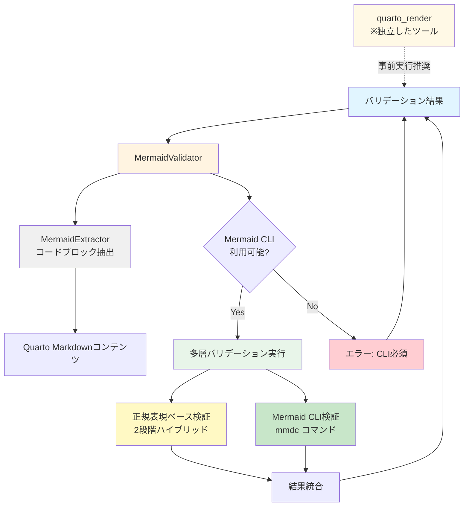

# Mermaidバリデーション機能 追加仕様書

## 1. 概要

### 1.1 目的

Quarto Markdownコンテンツ内に含まれるMermaid記法のダイアグラム定義をレンダリング前に検証し、構文エラーや問題を事前に検出することで、Quarto CLIでのレンダリング失敗を未然に防ぐ機能を追加する。

### 1.2 背景と課題

現在のQuarto MCP Serverでは以下の課題が存在する：

- **Mermaid構文エラーの検出が遅い**: Quarto CLIレンダリング実行時まで構文エラーが検出されず、レンダリング時間が無駄になる
- **エラー情報が不明瞭**: Quarto CLIのエラーメッセージからMermaidの具体的な問題箇所を特定しにくい
- **事前検証の欠如**: コンテンツに含まれるMermaidダイアグラムの妥当性を事前チェックする手段がない
- **LLM生成コンテンツへの対応**: LLMが生成したMermaid記法に誤りが含まれる場合がある

### 1.3 追加機能の概要

本仕様では以下の機能を追加する：

- **独立した事前検証ツール**: `quarto_validate_mermaid`としてMCPツールを追加
- **多層バリデーション**: 正規表現ベース検証とMermaid CLI検証を両方実行
- **Mermaid構文バリデーション**: コンテンツ内のMermaidコードブロックを抽出・検証
- **不正記法の検出**: コードブロック形式の誤りやスペルミスを検出
- **詳細なエラーレポート**: 構文エラーの行番号と具体的な問題点を包括的に報告
- **レンダリング前の使用**: `quarto_render`実行前にユーザーが明示的に実行するツール

---

## 2. 機能要件

### 2.1 Mermaid構文の検出

#### 2.1.1 対象記法

Quarto Markdown内でMermaidダイアグラムを記述する方法は以下の2種類：

1. **Quarto拡張記法**（推奨）
   ````markdown
   ```{mermaid}
   graph TD
       A --> B
   ```
   ````

2. **標準Markdown記法**
   ````markdown
   ```mermaid
   graph TD
       A --> B
   ```
   ````

#### 2.1.2 抽出ロジック

- Quarto Markdownコンテンツ全体を解析し、上記パターンに一致するコードブロックを抽出
- 各コードブロックの開始行番号・終了行番号を記録
- ネストしたコードブロック（文字列内のコードブロック記述など）を除外
- 複数のMermaidコードブロックが存在する場合はすべて抽出

#### 2.1.3 不正な記法の検出（重要）

正しいコードブロック形式になっていないMermaid記法を検出する機能を追加する。**2段階チェック方式（ハイブリッド方式）**を採用し、精度と速度を両立させる。

**検出対象:**

```markdown
# 不正な例1: コードブロックが閉じられていない
```{mermaid}
graph TD
    A --> B
# 閉じタグ```がない

# 不正な例2: インラインコードとして記述
ここに`graph TD; A-->B`というMermaid図を入れたい

# 不正な例3: プレーンテキストとして記述
graph TD
    A --> B
    B --> C

# 不正な例4: 言語指定のスペルミス
```mermaaid
graph TD
    A --> B
```

# 不正な例5: コードブロックマーカーの形式ミス
````
``` {mermaid}
graph TD
    A --> B
```
````

# 不正な例9: 空のコードブロック
```{mermaid}
```

# 不正な例10: コードブロック外のMermaid構文要素
本文にsubgraphやparticipantなどのキーワードが含まれている
--> という矢印記号も含まれている

**検出方式: 2段階ハイブリッドチェック**

**第1段階: 正規表現による不正パターン検出**
- よくある間違いパターンを正規表現で高速検出
- 明らかな誤りを即座に発見

**第2段階: コンテキスト検証によるキーワード検出**
- Mermaidダイアグラムキーワードをテキスト全体から検索
- コードブロック内外の判定を行い、ブロック外のキーワードを警告

**検出結果の重大度:**
- `error`: 確実に不正な記法（正規表現で検出）
- `warning`: 疑わしい記法（コンテキスト検証で検出、誤検知の可能性あり）

### 2.2 Mermaid構文バリデーション

#### 2.2.1 バリデーションエンジン

本機能は**複数の検証を全て実行する多層バリデーション方式**を採用する。各検証エンジンが異なる観点から問題を検出し、検出された全ての異常を統合して報告する。

**バリデーションエンジン構成（全て必須実行）:**

1. **正規表現ベース検証（必須実行）**
   - よくある記述ミスや形式エラーを高速検出
   - スペルミス、コードブロック外のキーワード、形式エラーを検出
   - 2段階ハイブリッドチェック（正規表現 + コンテキスト検証）を実行
   - 実行タイミング: 他の検証と並行して必ず実行

2. **Mermaid CLI検証（必須実行）**
   - `@mermaid-js/mermaid-cli`（mmdc）による公式バリデーション
   - 構文チェックのみ実行（`--parseOnly`オプション使用予定）
   - 最も正確で信頼性の高い構文検証
   - すべてのMermaid構文に対応
   - 要件: Node.js 14以上、npm/npx経由でインストール必須
   - 実行タイミング: 正規表現検証と並行して必ず実行

**重要: Mermaid CLIは必須要件**
- Mermaid CLIが未インストールの場合、バリデーションツールは実行エラーを返す
- フォールバック処理は行わない
- ユーザーにMermaid CLIのインストール手順を明示的に案内する

**実装方針**: 全ての検証を必ず実行し、検出された問題を全て統合して報告する

#### 2.2.2 検証項目

以下の項目を検証する：

1. **ダイアグラムタイプの宣言**: `graph`, `flowchart`, `sequenceDiagram`等が正しく記述されているか
2. **構文の完全性**: 開始・終了のペアが正しく対応しているか（括弧、引用符等）
3. **ノード・エッジ定義**: ノードIDとエッジの記述が正しい形式か
4. **予約語の使用**: Mermaidの予約語が正しく使用されているか
5. **スタイル定義**: `style`や`class`定義が正しい構文か

#### 2.2.3 バリデーション結果

各Mermaidコードブロックに対して以下の情報を返す：

**Mermaidバリデーション結果（単一ブロック）:**
- コードブロックのインデックス（0始まり）
- コードブロック開始行番号（1始まり）
- コードブロック終了行番号（1始まり）
- バリデーション結果の真偽値
- ダイアグラムタイプ（graph、flowchart等、任意）
- エラーメッセージ（任意）
- エラー発生行番号（コードブロック内の相対行番号、任意）
- 警告メッセージのリスト

**コードブロック外のMermaid記法検出結果:**
- 検出された行番号（1始まり）
- 問題のタイプ（"unblocked", "malformed", "typo", "unclosed"）
- 重大度（"error", "warning"）
- 検出されたキーワード（任意）
- 検出されたパターン（任意）
- 修正提案メッセージ
- 該当行のテキスト（前後トリミング済み）

### 2.3 MCPツールの追加

#### 2.3.1 新規ツール: `quarto_validate_mermaid`

Mermaid構文のバリデーションを実行する**独立した事前検証ツール**。`quarto_render`実行前にユーザーが明示的に呼び出すことで、Mermaidコードブロックの妥当性を事前確認できる。Mermaid CLIを使用した検証を行う。

**使用タイミング**: `quarto_render`を実行する前に、コンテンツにMermaidダイアグラムが含まれる場合に実行することを推奨。

**パラメータ:**

| パラメータ名 | 型 | 必須 | 説明 |
|------------|-----|------|------|
| `content` | string | ✓ | Quarto Markdown形式のコンテンツ |
| `strict_mode` | boolean | - | 厳密モード（警告もエラーとして扱う）デフォルト: false |

**戻り値:**

Mermaidバリデーションレスポンスとして以下の情報を含む：
- 全体の成功フラグ（真偽値）
- 検出されたMermaidブロック数
- 有効なブロック数
- 無効なブロック数
- 各ブロックの詳細結果リスト
- コードブロック外の問題リスト
- 使用したバリデーションエンジン名（"mermaid-cli" または "simple"）
- メタデータ（バリデーション実行時間等）

**ツールの独立性:**

本ツールは`quarto_render`とは完全に独立しており、以下の特徴を持つ：

- `quarto_render`に対する依存関係なし
- ユーザーが明示的に呼び出す必要がある
- バリデーション結果のみを返し、レンダリングは行わない
- エラーが検出されても、その後の`quarto_render`実行を妨げない

---

## 3. アーキテクチャ設計

### 3.1 コンポーネント構成



### 3.2 モジュール構成

#### 3.2.1 新規モジュール

**ファイル構成:**
```
src/
├── validators/
│   ├── __init__.py
│   ├── mermaid_validator.py    # メインバリデータ（統括クラス）
│   ├── mermaid_extractor.py    # Mermaidコードブロック抽出
│   ├── mermaid_cli.py          # Mermaid CLI連携（必須）
│   └── regex_validator.py      # 正規表現ベース検証（必須実行）
├── models/
│   └── validation_schemas.py   # バリデーション用スキーマ
└── tools/
    └── validate_mermaid.py      # MCPツール実装
```

#### 3.2.2 各モジュールの責務

**mermaid_extractor.py**
- Quarto Markdownコンテンツから```{mermaid}と```mermaidパターンを抽出
- 各コードブロックの行番号とコンテンツを返す
- ネストしたコードブロックを除外する処理
- **不正な記法の検出機能**（2段階ハイブリッドチェック）
  - 正規表現による不正パターン検出
  - コンテキスト検証によるキーワード検出

**mermaid_validator.py**
- バリデーションの統括クラス
- Mermaid CLIの利用可能性をチェック（未インストール時はエラー）
- **全ての検証を並行実行**：
  - 正規表現ベース検証（2段階ハイブリッドチェック）
  - Mermaid CLI検証（mmdc）
- 抽出されたMermaidブロックを検証
- 全ての検証結果を統合して返す

**mermaid_cli.py**
- Mermaid CLI（mmdc）の検出と実行（必須）
- mmdcコマンドを実行してバリデーション（標準入出力方式）
- mmdcのエラー出力をパースして詳細なエラー情報を生成
- バージョン情報の取得
- タイムアウト制御
- 未インストール時は明確なエラーを返す

**regex_validator.py**
- 正規表現ベースの構文チェック（必須実行）
- 2段階ハイブリッドチェック：
  - 第1段階: 不正パターンの正規表現検出
  - 第2段階: コンテキスト検証によるキーワード検出
- スペルミス、形式エラー、コードブロック外キーワードを検出
- Mermaid CLI検証とは独立して必ず実行

**validation_schemas.py**
- バリデーション結果のPydanticモデル定義
- `MermaidValidationResult`, `MermaidValidationResponse`等

**validate_mermaid.py**
- MCPツール`quarto_validate_mermaid`の実装
- パラメータ処理とバリデータ呼び出し
- エラーハンドリング
- レスポンスの整形と返却

---

## 4. 実装詳細

### 4.1 Mermaidコードブロック抽出と不正記法検出

#### 4.1.1 抽出パターンの定義

Mermaidコードブロックを抽出するために以下のパターンを定義する：

**正規表現パターン:**
- Quarto拡張記法: 3つのバッククォート、開き波括弧、mermaid、閉じ波括弧で始まり、3つのバッククォートで終わるパターン
- 標準Markdown記法: 3つのバッククォート、mermaid で始まり、3つのバッククォートで終わるパターン

**Mermaidダイアグラムタイプキーワード:**
- graph, flowchart, sequenceDiagram, classDiagram, stateDiagram, erDiagram, gantt, pie, gitGraph, journey, quadrantChart, requirementDiagram, C4Context

**不正パターン（第1段階検出用）:**

1. **スペルミスパターン:**
   - mermaid言語指定: mermiad, mermeid, mermad, mermaaid, mremaid, meramid, marmaid
   - ダイアグラムタイプ: flowchrat, sequencDiagram, classDigram, stateDiagarm

2. **波括弧の不要なスペース:**
   - ` ```{ mermaid }`, ` ```{mermaid }`, ` ```{ mermaid}`
   - 検出パターン: `\{\s+mermaid|\mermaid\s+\}`

3. **コードブロックマーカーの不一致:**
   - 開始と終了のバッククォート数が異なる（3つ vs 4つ等）
   - ブロック開始と終了のバッククォート数をカウントして検証

4. **引用符の不一致:**
   - ダブルクォート開始でシングルクォート終了 `"text'`
   - 開き引用符のみで閉じ引用符なし
   - 各行での引用符ペアをチェック

5. **コードブロックの未閉鎖:**
   - ` ```{mermaid}` で開始するが終了マーカー ` ``` なし
   - 開始マーカー後に対応する終了マーカーがない

6. **ネストしたコードブロックの誤り:**
   - コードブロック内にさらにコードブロック開始マーカー
   - コードブロック内での ` ``` の検出

7. **言語指定なしのコードブロック:**
   - ` ``` のみで言語指定なし（内容がMermaidと思われる）
   - コードブロック内にMermaidキーワードがあるが言語指定なし

8. **インラインコードとしての誤用:**
   - `` `graph TD` `` のようなバッククォート1つの記述
   - バッククォート1つで囲まれた中にMermaidキーワードを検出

9. **コメント記法の誤り:**
   - `//` コメントをコードブロック外に記述
   - `%%` 以外の不正なコメント記法を検出

#### 4.1.2 コードブロック抽出処理

**処理フロー:**
1. Quarto Markdownコンテンツ全体を行単位に分割
2. 各パターン（Quarto拡張、標準Markdown）で正規表現マッチングを実行
3. マッチした各ブロックについて以下を記録:
   - ブロックのインデックス番号
   - 開始行番号と終了行番号
   - コードブロックマーカーを除いた実際のMermaidコード本体
4. 抽出結果を辞書のリストとして返す

#### 4.1.3 不正記法検出処理（2段階ハイブリッド方式）

**第1段階: 正規表現による不正パターン検出**

処理内容:
1. コンテンツを行単位に分割
2. 定義済みの不正パターンリストを順次適用
3. 各パターンにマッチした行について:
   - 行番号を記録
   - 問題タイプ（typo, malformed, unclosed）を判定
   - 重大度を"error"に設定
   - マッチしたパターンと修正提案メッセージを記録
   - 該当行のテキストを80文字以内でトリミングして記録
4. 検出された問題のリストを返す

**第2段階: コンテキスト検証によるキーワード検出**

処理内容:
1. コンテンツを行単位に分割し、現在位置がコードブロック内外かを追跡
2. 各行を順次処理:
   - 3つのバッククォートで始まる行を検出してコードブロック状態を切り替え
   - mermaidキーワードが含まれる場合はMermaidブロック内フラグを設定
3. コードブロック外の行について以下を検出:
   
   **A. ダイアグラムタイプキーワード:**
   - 各Mermaidキーワードの存在を正規表現でチェック（行頭または空白後にキーワード）
   - graph, flowchart, sequenceDiagram等のタイプ宣言がブロック外に存在
   
   **B. Mermaid構文要素:**
   - `-->`, `---`, `==>` 等の矢印記号がブロック外
   - `subgraph`, `end`, `participant` 等の予約語がブロック外
   
   **C. 検出時の処理:**
   - 行番号、キーワード、問題タイプ（unblocked）を記録
   - 重大度を"warning"に設定（誤検知の可能性を考慮）
   - 修正提案メッセージとコンテキストを記録
   - 1行につき1回のみ警告を発行

4. **空のコードブロックの検出:**
   - ` ```{mermaid}` と ` ``` の間に何も記述なし
   - コードブロック抽出時に空判定を実施

5. 検出された問題のリストを返す

**統合処理:**
- 第1段階と第2段階の検出結果を結合
- 両方の段階で検出された問題をすべて含むリストを返す

#### 4.1.4 行番号の追跡

行番号管理の詳細:
- コンテンツを改行文字で分割し、各行に1始まりの行番号を割り当て
- 正規表現でコードブロックを検出した際、マッチ開始位置と終了位置から行番号を算出
- コードブロックの開始マーカー行と終了マーカー行の行番号を記録
- コードブロック本体のテキストを抽出する際、マーカー行を除外して純粋なMermaidコードのみを取得

#### 4.1.5 不正記法検出の精度向上

**誤検知の抑制方法:**
- インラインコード検出: バッククォート1つで囲まれた範囲内のテキストを検査対象から除外
- 引用ブロック検出（オプション機能）: 行頭が「>」で始まる行のキーワードを除外
- HTMLコメント検出（オプション機能）: 「<!--」と「-->」で囲まれた範囲内のテキストを除外

**問題のマージと優先順位付け:**
- 同一行で複数の問題が検出された場合、重大度によるフィルタリングを実施
- "error"重大度の問題が存在する場合、同一行の"warning"を除外
- 完全に同一の問題（行番号、問題タイプ、キーワードが一致）が重複する場合は1つにマージ

### 4.2 Mermaid CLIバリデーション

#### 4.2.1 Mermaid CLIの検出と初期化

Mermaid CLIバリデータクラスの機能:

**利用可能性のチェック（必須要件）:**
- システムの実行パスから「mmdc」コマンドを検索
- コマンドが見つかった場合は利用可能と判定
- **見つからない場合は以下の処理を実行**：
  - エラーレスポンスを生成
  - エラーコード「MERMAID_CLI_NOT_FOUND」を設定
  - インストール手順を含む詳細なエラーメッセージを返す
  - バリデーション処理を中断

**バージョン情報の取得:**
- mmdcコマンドに「--version」オプションを付けて実行
- 5秒のタイムアウトを設定してコマンドを実行
- 標準出力からバージョン文字列を取得
- コマンドが正常終了した場合のみバージョン文字列を返す
- エラーや例外が発生した場合はNoneを返す

#### 4.2.2 バリデーション実行処理

Mermaid CLIを使用したバリデーション処理の詳細フロー:

**入力パラメータ:**
- Mermaidダイアグラムコード（文字列）
- タイムアウト秒数（デフォルト30秒）

**処理ステップ:**

1. **Mermaid CLIの実行（標準入出力方式）:**
   - mmdcコマンドをサブプロセスとして起動
   - コマンドオプション構成:
     - `-i -`: 標準入力からMermaidコードを読み込み
     - `-o /dev/null`: 出力を破棄（構文チェックのみ実行）
     - `--parseOnly`: レンダリングせず構文解析のみ実行
   - Mermaidコードを標準入力にUTF-8エンコーディングで送信
   - 標準出力と標準エラー出力の両方をキャプチャ
   - 指定されたタイムアウト時間で実行を制限
   - 一時ファイルを使用しないため、ファイルシステムI/Oのオーバーヘッドなし

2. **出力のパース:**
   - コマンドの終了ステータスコードを確認
   - 終了コード0: バリデーション成功
   - 終了コード0以外: バリデーション失敗
   - 標準エラー出力から以下の情報を抽出:
     - エラーメッセージ本文
     - エラー発生行番号（正規表現で「line X」等のパターンを検索）
     - ダイアグラムタイプ（コード先頭行から判定）
     - 警告メッセージ（エラーとは別に記録）

3. **結果の構造化:**
   - バリデーション成功/失敗の真偽値
   - 検出されたダイアグラムタイプ
   - エラーメッセージ（失敗時のみ）
   - エラー発生行番号（失敗時のみ）
   - 警告メッセージのリスト
   - これらを辞書形式で返す

**標準入出力方式の利点:**
- 一時ファイルの作成・削除処理が不要
- ファイルシステムへのアクセス回数削減によるパフォーマンス向上
- クリーンアップ処理が不要でコードが簡潔
- 並行処理時の一時ファイル名衝突リスクの排除

### 4.3 正規表現ベースバリデーション

#### 4.3.1 検証項目と処理

正規表現バリデータの実装内容（Mermaid CLI検証と並行して必ず実行）:

**対応ダイアグラムタイプキーワード:**
- graph, flowchart, sequenceDiagram, classDiagram, stateDiagram, erDiagram, gantt, pie, gitGraph, journey, quadrantChart, requirementDiagram, C4Context

**検証処理のフロー:**

1. **第1段階: 不正パターン検出**
   - スペルミスパターンのマッチング（mermiad, mermaaid等）
   - コードブロック形式エラーの検出（不要なスペース等）
   - 未閉鎖コードブロックの検出
   - 検出された問題は重大度「error」として記録

2. **第2段階: コンテキスト検証**
   - Mermaidキーワードのテキスト全体検索
   - コードブロック内外の判定
   - コードブロック外のキーワードを警告として記録
   - 検出された問題は重大度「warning」として記録

3. **誤検知の抑制:**
   - インラインコード内のキーワードを除外
   - HTMLコメント内のキーワードを除外
   - 引用文字列内のキーワードを除外

4. **結果の統合:**
   - 第1段階と第2段階の結果を結合
   - 同一行で重複する問題をマージ
   - 全ての検出問題をリストで返す

**重要: この検証は常に実行**
- Mermaid CLIの有無に関わらず必ず実行される
- Mermaid CLI検証と並行して実行され、両方の結果が統合される

### 4.4 MCPツール実装

#### 4.4.1 validate_mermaidツールの処理フロー

MCPツール「quarto_validate_mermaid」の実装詳細:

**機能概要:**
- Quarto Markdown内のMermaidコードブロックを検証する独立したツール
- quarto_renderとは完全に独立し、レンダリング前の事前検証用途で使用

**入力パラメータ:**
- content: Quarto Markdown形式の文字列（必須）
- strict_mode: 厳密モードフラグ、警告もエラーとして扱うか（デフォルト: false）

**処理フロー:**

1. **初期化フェーズ:**
   - Mermaidバリデータを初期化
   - Mermaid CLIの利用可能性をシステム環境から判定

2. **前提条件チェック（必須要件）:**
   - Mermaid CLIが利用不可の場合:
     - エラーレスポンスを生成
     - エラーコード「MERMAID_CLI_NOT_FOUND」を設定
     - インストール方法を含む詳細メッセージを追加:
       ```
       npm install -g @mermaid-js/mermaid-cli
       ```
     - 処理を中断してエラーを返す

3. **バリデーション実行（多層検証）:**
   - コンテンツとstrict_modeフラグを指定してバリデーション処理を実行
   - 以下の全ての処理を実行:
     - Mermaidコードブロックの抽出
     - **正規表現ベース検証**（2段階ハイブリッド方式）
       - 不正パターン検出
       - コンテキスト検証
     - **Mermaid CLI検証**（mmdc）
       - 各ブロックの構文チェック
     - 全ての結果の集約と構造化

4. **結果の返却:**
   - バリデーション成功時:
     - MermaidValidationResponse形式で結果を返す
     - 全ブロックの検証結果と不正記法の検出結果を含む
   - バリデーション失敗時:
     - 各ブロックの詳細エラー情報を含めて返す

5. **例外処理:**
   - 予期しない例外が発生した場合:
     - ErrorResponse形式でエラーを返す
     - エラーコード「VALIDATION_ERROR」を設定
     - 例外メッセージを詳細情報に含める
     - スタックトレースは含めない（セキュリティ考慮）

**戻り値:**
- 辞書形式のバリデーション結果またはエラー情報

---

## 5. エラーハンドリング

### 5.1 エラーコード定義

| エラーコード | 説明 | 対処方法 |
|------------|------|----------|
| `MERMAID_VALIDATION_FAILED` | Mermaid構文エラー | エラー詳細を確認しMermaidコードを修正 |
| `MERMAID_UNBLOCKED_FOUND` | コードブロック外のMermaid記法検出 | 検出箇所をコードブロックで囲む |
| `MERMAID_MALFORMED_BLOCK` | コードブロックの形式エラー | コードブロックマーカーを修正 |
| `MERMAID_TYPO` | Mermaidスペルミス | "mermaid"のスペルを修正 |
| `MERMAID_EXTRACTOR_ERROR` | コードブロック抽出失敗 | コンテンツ形式を確認 |
| `MERMAID_CLI_NOT_FOUND` | Mermaid CLI未インストール | `npm install -g @mermaid-js/mermaid-cli`でインストール |
| `MERMAID_CLI_TIMEOUT` | Mermaid CLIタイムアウト | タイムアウト時間を延長 |
| `MERMAID_CLI_ERROR` | Mermaid CLI実行エラー | Mermaid CLIのバージョンを確認 |

### 5.2 エラーメッセージ形式

詳細なエラー情報を提供し、ユーザーが問題箇所を特定しやすくする。

**構文エラー:**
```
Mermaid validation failed: 2 invalid block(s) found

Block 1 (lines 15-23):
  Error at line 3: Unexpected token 'A-->'
  Expected: 'A --> B' or 'A --- B'
  
Block 2 (lines 45-52):
  Error at line 5: Unclosed bracket in node definition
  Line: 'B[Open bracket'
```

**不正な記法:**
```
Unblocked Mermaid issues found: 3 issue(s)

[ERROR] Line 42:
  Issue: スペルミス: "mermaid"の誤記
  Context: ```mermaaid
  Suggestion: "mermaid"のスペルを確認してください

[WARNING] Line 58:
  Issue: Mermaidキーワード "graph" がコードブロック外にあります
  Context: graph TD
  Suggestion: コードブロックで囲んでください:
    ```{mermaid}
    graph TD
        ...
    ```

[WARNING] Line 102:
  Issue: Mermaidキーワード "flowchart" がコードブロック外にあります
  Context: flowchart LR
  Suggestion: コードブロックで囲んでください
```

---

## 6. 設定とオプション

### 6.1 設定ファイル拡張

`config/templates.yaml`（または新規`config/validation.yaml`）にMermaidバリデーション設定を追加：

```yaml
mermaid_validation:
  # Mermaid CLIのパス（未指定の場合はPATHから自動検索）
  mermaid_cli_path: null
  
  # バリデーションタイムアウト（秒）
  timeout: 30
  
  # デフォルトで厳密モードを使用するか
  strict_mode: false
```

### 6.2 環境変数

以下の環境変数でバリデーション動作を制御可能：

| 環境変数 | 説明 | デフォルト |
|---------|------|-----------|
| `QUARTO_MCP_VALIDATE_MERMAID` | 自動バリデーション有効化 | `true` |
| `QUARTO_MCP_MERMAID_STRICT` | 厳密モード | `false` |
| `MERMAID_CLI_PATH` | Mermaid CLIのパス（mmdc） | （空：自動検出） |
| `QUARTO_MCP_MERMAID_TIMEOUT` | バリデーションタイムアウト（秒） | `30` |

---

## 7. テスト計画

### 7.1 ユニットテスト

#### 7.1.1 MermaidExtractorのテスト

- Quarto拡張記法の抽出
- 標準Markdown記法の抽出
- 複数ブロックの抽出
- ネストしたコードブロックの除外
- 行番号の正確性
- **不正記法の検出**:
  - スペルミスの検出
  - コードブロック外のキーワード検出
  - 形式エラーの検出
  - 誤検知の抑制（インラインコード内除外等）

#### 7.1.2 正規表現ベースバリデータのテスト

- 2段階ハイブリッドチェックの動作確認
- 第1段階: 不正パターンの正規表現検出テスト
  - スペルミスパターンの検出
  - 形式エラーの検出
- 第2段階: コンテキスト検証テスト
  - コードブロック外キーワードの検出
  - 誤検知抑制機構の動作確認
- 両段階の結果統合テスト

#### 7.1.3 MermaidCliValidatorのテスト

- Mermaid CLIの検出
- 有効なコードの検証
- 無効なコードのエラー検出
- タイムアウト処理

### 7.2 統合テスト

#### 7.2.1 quarto_validate_mermaidツールのテスト

- 正常系：すべて有効なMermaidブロック
- 異常系：一部または全部が無効なブロック
- **多層検証の動作確認**：
  - 正規表現ベース検証とMermaid CLI検証の両方が実行されること
  - 両方の結果が統合されて返されること
- Mermaid CLI未インストール時のエラーハンドリング
- 厳密モード

#### 7.2.2 ワークフローテスト

- `quarto_validate_mermaid`実行後に`quarto_render`を実行する標準ワークフロー
- バリデーション成功後のレンダリング
- バリデーション失敗時にユーザーがコンテンツを修正するフロー
- 複数回のバリデーション→修正→レンダリングサイクル

### 7.3 テストケース設計

#### 7.3.1 Quarto拡張記法の抽出テスト

**テスト目的:** Quarto拡張記法のMermaidブロックを正しく抽出できることを確認

**テストデータ:**
- 見出し行を含むQuarto Markdownテキスト
- Quarto拡張記法（3つのバッククォート + 波括弧付きmermaid）のコードブロック
- graph TD形式のシンプルなMermaidダイアグラム
- コードブロック後に通常のテキスト

**検証項目:**
- 抽出されたブロック数が1であること
- ブロックの開始行番号が正しいこと（3行目）
- ブロックの終了行番号が正しいこと（6行目）
- 抽出されたコード本体にMermaidコードが含まれること
- コードブロックマーカーが除外されていること

#### 7.3.2 無効なMermaid構文の検出テスト

**テスト目的:** 無効なMermaid構文をMermaid CLIバリデータで検出できることを確認

**テストデータ:**
- graph TD宣言を含むMermaidコード
- 不完全なエッジ定義（終端ノードなし）
- 構文エラーを含むコード

**検証項目:**
- バリデーション結果が失敗（is_validがfalse）であること
- エラーメッセージが設定されていること
- エラーメッセージに問題の内容が含まれること
- エラー行番号が正しく検出されていること

---

## 8. ユーザーインターフェース

### 8.1 MCPクライアントでの使用例

#### 8.1.1 独立したバリデーション

```json
{
  "tool": "quarto_validate_mermaid",
  "arguments": {
    "content": "# スライド\n\n```{mermaid}\ngraph TD\n    A --> B\n```",
    "strict_mode": false
  }
}
```

**レスポンス例（成功）:**

```json
{
  "success": true,
  "total_blocks": 1,
  "valid_blocks": 1,
  "invalid_blocks": 0,
  "results": [
    {
      "block_index": 0,
      "start_line": 3,
      "end_line": 6,
      "is_valid": true,
      "diagram_type": "graph",
      "error_message": null,
      "error_line": null,
      "warnings": []
    }
  ],
  "unblocked_issues": [],
  "validation_engine": "mermaid-cli",
  "metadata": {
    "total_validation_time_ms": 150
  }
}
```

**レスポンス例（エラー）:**

```json
{
  "success": false,
  "total_blocks": 2,
  "valid_blocks": 1,
  "invalid_blocks": 1,
  "results": [
    {
      "block_index": 0,
      "start_line": 3,
      "end_line": 6,
      "is_valid": true,
      "diagram_type": "graph",
      "error_message": null,
      "error_line": null,
      "warnings": []
    },
    {
      "block_index": 1,
      "start_line": 12,
      "end_line": 18,
      "is_valid": false,
      "diagram_type": "flowchart",
      "error_message": "Unexpected token at line 4",
      "error_line": 4,
      "warnings": ["Style definition may not be supported"]
    }
  ],
  "unblocked_issues": [
    {
      "line": 42,
      "issue_type": "typo",
      "severity": "error",
      "pattern": "```mermaaid",
      "suggestion": "スペルミス: \"mermaid\"の誤記",
      "context": "```mermaaid"
    },
    {
      "line": 58,
      "issue_type": "unblocked",
      "severity": "warning",
      "keyword": "graph",
      "suggestion": "Mermaidキーワード \"graph\" がコードブロック外にあります。コードブロックで囲んでください。",
      "context": "graph TD"
    }
  ],
  "validation_engine": "mermaid-cli",
  "metadata": {
    "total_validation_time_ms": 280
  }
}
```

#### 8.1.2 推奨ワークフロー（事前検証 → レンダリング）

```json
// ステップ1: 事前にMermaidバリデーションを実行
{
  "tool": "quarto_validate_mermaid",
  "arguments": {
    "content": "# スライド\\n\\n```{mermaid}\\ngraph TD\\n    A --> B\\n```",
    "strict_mode": false
  }
}

// レスポンス: バリデーション成功
{
  "success": true,
  "total_blocks": 1,
  "valid_blocks": 1,
  "invalid_blocks": 0,
  ...
}

// ステップ2: バリデーション成功を確認後、レンダリング実行
{
  "tool": "quarto_render",
  "arguments": {
    "content": "# スライド\\n\\n```{mermaid}\\ngraph TD\\n    A --> B\\n```",
    "format": "pptx",
    "output_path": "/path/to/output.pptx"
  }
}
```

**バリデーションエラー時の対応:**

```json
// ステップ1: バリデーション実行
{
  "tool": "quarto_validate_mermaid",
  "arguments": {
    "content": "# スライド\\n\\n```{mermaid}\\ngraph TD\\n    A --\\n```"
  }
}

// レスポンス: エラー検出
{
  "success": false,
  "total_blocks": 1,
  "valid_blocks": 0,
  "invalid_blocks": 1,
  "results": [
    {
      "block_index": 0,
      "start_line": 3,
      "end_line": 6,
      "is_valid": false,
      "error_message": "Syntax error at line 2: Unexpected token '--'",
      "error_line": 2
    }
  ]
}

// ステップ2: ユーザーがコンテンツを修正
// ステップ3: 再度バリデーション実行
// ステップ4: 成功後にquarto_renderを実行
```

---

## 9. ドキュメント更新

### 9.1 README更新

以下のセクションを追加：

- **Mermaidバリデーション機能**の概要
- **Mermaid CLIのインストール方法**（必須要件として記載）
- `quarto_validate_mermaid`ツールの使用方法（独立したツールであることを明記）
- 推奨ワークフロー（バリデーション → レンダリング）
- トラブルシューティング（Mermaid CLI未インストール時の対処）

### 9.2 SPEC.md更新

- **7. Mermaidバリデーション**章を追加
- `quarto_validate_mermaid`ツールの説明を追加（独立したツールとして）
- アーキテクチャ図にバリデーションコンポーネントを追加
- エラーコード一覧にMermaid関連エラーを追加
- 推奨ワークフローの記載

---

## 10. 制約事項と注意点

### 10.1 技術的制約

- **Mermaid CLIの必須依存**: Node.js 14以上とnpm/npxが必要
- **インストール要件**: `@mermaid-js/mermaid-cli`をグローバルインストール必須
- **バージョン互換性**: Mermaidのバージョンによって構文サポートが異なる（最新版推奨）
- **多層検証オーバーヘッド**: 複数の検証エンジンを実行するため、処理時間が増加する可能性がある

### 10.2 セキュリティ考慮事項

- **タイムアウト制御**: 長時間実行の防止
- **標準入力の安全性**: 標準入出力方式によるファイルシステムアクセスの最小化

### 10.3 互換性

- **既存機能への影響**: なし（完全に独立した新規ツール）
- **後方互換性**: `quarto_render`には一切変更なし
- **ツールの独立性**: `quarto_validate_mermaid`と`quarto_render`は互いに依存しない

---

## 11. まとめ

### 11.1 期待される効果

- **開発効率の向上**: レンダリング前にMermaid構文エラーを早期発見
- **エラー情報の改善**: 詳細で分かりやすいエラーメッセージ
- **ユーザー体験の向上**: レンダリング失敗を事前に防止
- **LLM生成コンテンツの品質向上**: 事前検証による品質保証
- **ワークフローの明確化**: 検証フェーズとレンダリングフェーズを明確に分離
- **多角的な問題検出**: 複数の検証エンジンにより様々な種類のエラーを包括的に検出
