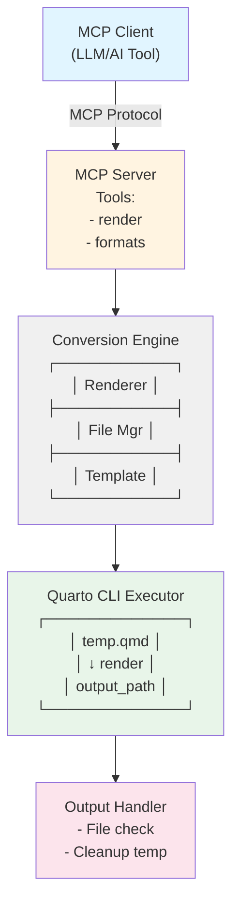
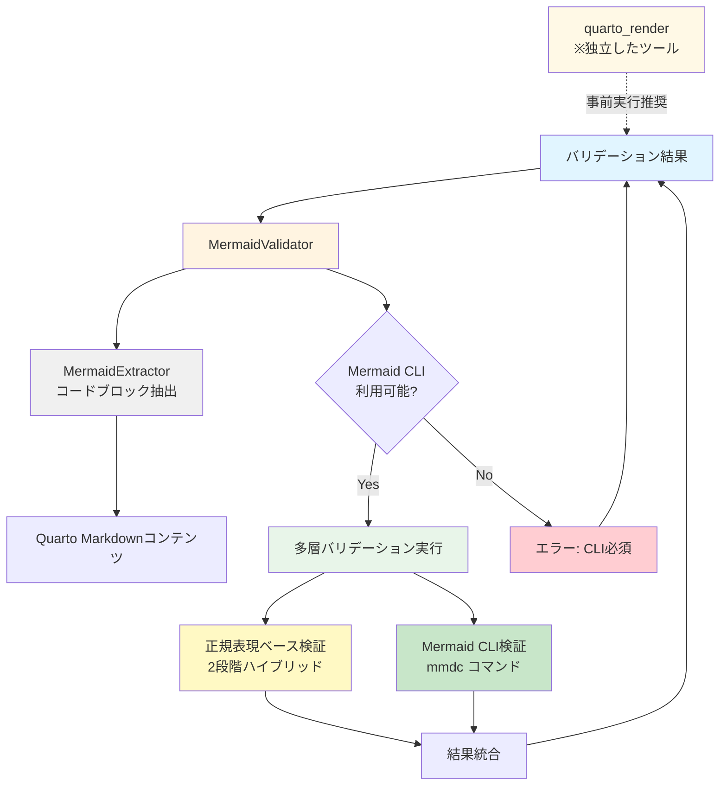

# Quarto MCP サーバー設計書

## 1. 概要

### 1.1 目的

Quarto Markdown（.qmd形式）を文字列として受け取り、PowerPoint（.pptx）形式を中心としたQuarto CLIがサポートする多様な出力形式に変換する MCP（Model Context Protocol）対応サーバーを設計・実装する。特にPowerPoint出力においては、カスタムテンプレートを利用した企業・組織固有のデザイン適用を可能にする。

### 1.2 主要機能

本サーバーは以下の機能を提供する：

- **PowerPoint形式を主軸**: 企業プレゼンテーション作成を最優先ユースケースとして設計
- **カスタムテンプレート対応**: PowerPointの企業テンプレート（.pptx）を指定可能
  - 設定ファイルで複数テンプレートを事前登録
  - ツール引数でテンプレートIDまたはURLを指定
  - URL指定時は自動ダウンロードして使用
- **文字列ベースの入力**: LLM/MCPクライアントから純粋な文字列として Quarto Markdown を受理
- **多形式出力対応**: PowerPoint以外にもQuarto CLIがサポートする全形式に対応
- **ファイルパス出力**: 指定されたパスに直接出力ファイルを生成
- **静的変換のみ**: セキュリティ確保のため、コードセル実行は行わない（`--no-execute`固定）
- **エラーハンドリング**: 詳細なエラー情報の提供

### 1.3 設計原則

- **再現性**: 同じ入力に対して常に同じ出力を生成
- **分離性**: 各変換ジョブは独立した環境で実行
- **拡張性**: 新しい出力形式の追加が容易な設計

---

## 2. Quarto 出力形式

### 2.1 サポート対象形式

Quarto CLIは以下の出力形式をサポートする。本サーバーは全形式に対応するが、特にPowerPoint形式を重点的にサポートする：

#### プレゼンテーション形式（推奨）
| 形式ID | 説明 | 拡張子 | 用途 |
|--------|------|--------|------|
| `html` | HTML5 ドキュメント | `.html` | Webページ、技術文書 |
| `pdf` | PDF (via LaTeX) | `.pdf` | 印刷用、論文、レポート |
| `docx` | Microsoft Word | `.docx` | 編集可能な文書 |
| `odt` | OpenDocument Text | `.odt` | オープンソース文書 |
| `epub` | 電子書籍形式 | `.epub` | 電子書籍出版 |
| `typst` | Typst組版システム | `.pdf` | 高速PDF生成 |

| 形式ID | 説明 | 拡張子 | 用途 | カスタムテンプレート |
|--------|------|--------|------|------------------|
| `pptx` | **PowerPoint** | `.pptx` | **企業プレゼン、編集可能な資料（最優先）** | **対応（reference-doc）** |
| `revealjs` | Reveal.js HTMLプレゼン | `.html` | インタラクティブプレゼン | 対応（CSS/テーマ） |
| `beamer` | LaTeX Beamer | `.pdf` | 学術プレゼンテーション | 対応（LaTeXテンプレート） |

#### ドキュメント形式

#### Markdown形式
| 形式ID | 説明 | 拡張子 | 用途 |
|--------|------|--------|------|
| `gfm` | GitHub Flavored Markdown | `.md` | GitHub/GitLab文書 |
| `commonmark` | CommonMark標準 | `.md` | 標準的なMarkdown |
| `hugo` | Hugo静的サイト | `.md` | Hugoサイト生成 |
| `docusaurus` | Docusaurusドキュメント | `.md` | ドキュメントサイト |
| `markua` | Markua (Leanpub) | `.md` | 電子書籍執筆 |

#### Wiki形式
| 形式ID | 説明 | 拡張子 | 用途 |
|--------|------|--------|------|
| `mediawiki` | MediaWiki | `.wiki` | Wikipedia形式 |
| `dokuwiki` | DokuWiki | `.txt` | DokuWikiサイト |
| `zimwiki` | Zim Wiki | `.txt` | Zimデスクトップwiki |
| `jira` | Jira Wiki | `.txt` | Atlassian Jira |
| `xwiki` | XWiki | `.txt` | XWikiシステム |

#### その他形式
| 形式ID | 説明 | 拡張子 | 用途 |
|--------|------|--------|------|
| `jats` | JATS XML (学術誌) | `.xml` | 学術論文出版 |
| `ipynb` | Jupyter Notebook | `.ipynb` | データサイエンス |
| `rtf` | Rich Text Format | `.rtf` | クロスプラットフォーム |
| `rst` | reStructuredText | `.rst` | Python/Sphinx文書 |
| `asciidoc` | AsciiDoc | `.adoc` | 技術文書 |
| `org` | Emacs Org-Mode | `.org` | Emacsドキュメント |
| `context` | ConTeXt | `.tex` | 高度な組版 |
| `texinfo` | GNU Texinfo | `.texi` | GNUドキュメント |
| `man` | Groff man page | `.man` | UNIXマニュアル |

### 2.2 Quarto CLI コマンド仕様

基本的な変換コマンド構文：

```bash
quarto render <input.qmd> --to <format> [options]
```

#### 主要オプション
- `--to <format>`: 出力形式を指定（必須）
- `--output <file>`: 出力ファイル名を指定
- `--output-dir <dir>`: 出力ディレクトリを指定
- `--execute`: コードセルを実行（デフォルト: true）
- `--no-execute`: コードセルを実行しない
- `--execute-daemon`: 永続的なデーモンプロセスで実行
- `--execute-daemon-restart`: デーモンを再起動して実行

#### 実行例

```bash
# HTML生成
quarto render document.qmd --to html

# PDF生成（コード実行なし）
quarto render document.qmd --to pdf --no-execute

# PowerPoint生成（出力先指定）
quarto render document.qmd --to pptx --output-dir ./output

# 複数形式同時生成（YAMLで指定）
quarto render document.qmd
```

---

## 3. システムアーキテクチャ

### 3.1 論理構成



### 3.2 コンポーネント詳細

#### 3.2.1 MCP Server
- **役割**: MCPプロトコルの実装、ツール公開、リクエスト処理
- **言語**: Python
- **フレームワーク**: `mcp` SDK
- **責務**:
  - MCPツールの定義と登録
  - Conversion Engineの呼び出し
  - エラーハンドリングとレスポンス生成

#### 3.2.2 Conversion Engine
- **役割**: Quarto変換処理のコア実装
- **責務**:
  - 一時ファイルシステムの管理
  - Quarto CLIの呼び出し（出力先パス指定）
  - 出力ファイルの存在確認と検証

#### 3.2.3 File Manager
- **役割**: 一時ファイル/ディレクトリの安全な管理
- **実装**: `tempfile` モジュール（Python）等
- **責務**:
  - 隔離されたtempディレクトリ作成
  - .qmdファイル書き込み
  - 変換後のクリーンアップ
  - タイムアウト時の強制削除

#### 3.2.4 Quarto CLI Executor
- **役割**: Quarto CLIの実行とプロセス管理
- **実装**: `subprocess` / `asyncio.create_subprocess_exec`
- **責務**:
  - コマンドライン引数の構築
  - プロセス起動と監視
  - stdout/stderrのキャプチャ
  - タイムアウト制御

---

## 4. MCP ツール定義

### 4.1 `quarto_render` ツール

**目的**: Quarto Markdownを指定形式に変換

#### 入力パラメータ

**content（必須）**
- データ型: 文字列
- 説明: Quarto Markdown形式（.qmd相当）の文字列

**format（必須）**
- データ型: 文字列（列挙型）
- 説明: 出力形式を指定
- 許可値: `pptx`, `html`, `pdf`, `docx`, `revealjs`, `beamer`, `gfm`, `commonmark`, `epub`, `jats`, `ipynb`, `rtf`, `rst`, `asciidoc`, `org`, `mediawiki`, `dokuwiki`, `zimwiki`, `jira`, `xwiki`, `context`, `texinfo`, `man`
- 推奨: `pptx`（PowerPoint）を最優先

**output_path（必須）**
- データ型: 文字列
- 説明: 出力ファイルを生成する絶対パス

**template（任意）**
- データ型: 文字列
- 説明: PowerPoint形式でのカスタムテンプレート指定
- 指定方法（以下のいずれか）:
  - **テンプレートID**: 設定ファイル（templates.yaml）で事前登録したテンプレート名を指定
    - 例: `"corporate_standard"`, `"sales_pitch"`, `"technical_report"`
  - **URL（HTTP/HTTPS）**: テンプレートファイル（.pptx）のURLを直接指定
    - 例: `"https://example.com/templates/custom.pptx"`
    - サーバーが自動的にダウンロードしてキャッシュ
    - HTTPSの使用を強く推奨（セキュリティ確保のため）
- 適用条件: `format`が`pptx`の場合のみ有効
- デフォルト: なし（Quartoのデフォルトテンプレート使用）
- 注意事項:
  - テンプレートIDを指定した場合、サーバー側の設定ファイルで定義されたパスに解決される
  - URLを指定した場合、一時ディレクトリにダウンロードされ、処理後に削除される
  - URL指定時はダウンロードタイムアウト（30秒）とファイルサイズ制限（50MB）あり

**format_options（任意）**
- データ型: オブジェクト
- 説明: 出力形式固有のオプション設定（Quarto YAMLヘッダー相当）
- デフォルト: 空オブジェクト
- 主な設定項目:
  - `toc`: 目次を生成するか（真偽値）
  - `number-sections`: セクション番号を付与するか（真偽値）
  - `theme`: テーマ名（文字列、形式により異なる）
  - `highlight-style`: コードハイライトスタイル（文字列）
  - `slide-level`: スライド分割レベル（整数、pptx/revealjs等で使用）
  - その他、形式依存の詳細オプション

#### 出力形式

**成功時のレスポンス**

- `success`: 真偽値、常に`true`
- `format`: 文字列、使用した出力形式ID
- `output`: オブジェクト、出力ファイル情報
  - `path`: 文字列、生成された出力ファイルの絶対パス
  - `filename`: 文字列、ファイル名のみ
  - `mime_type`: 文字列、MIMEタイプ（例: `application/pdf`, `text/html`）
  - `size_bytes`: 整数、ファイルサイズ（バイト単位）
- `metadata`: オブジェクト、変換メタデータ
  - `quarto_version`: 文字列、使用したQuarto CLIのバージョン
  - `render_time_ms`: 整数、変換処理時間（ミリ秒）
  - `warnings`: 配列、警告メッセージのリスト（空の場合もある）

#### エラーレスポンス

**失敗時のレスポンス**

- `success`: 真偽値、常に`false`
- `error`: オブジェクト、エラー詳細情報
  - `code`: 文字列、エラーコード（INVALID_INPUT, UNSUPPORTED_FORMAT, RENDER_FAILED, TIMEOUT, DEPENDENCY_MISSING, OUTPUT_NOT_FOUND）
  - `message`: 文字列、エラーの概要メッセージ
  - `details`: 文字列、エラーの詳細説明（ユーザー向け解決策を含む）
  - `quarto_output`: 文字列、Quarto CLIの標準エラー出力内容
  - `timestamp`: 文字列、エラー発生日時（ISO 8601形式）

## 5. 実装仕様

### 5.1 ディレクトリ構造

```
quarto-mcp-server/
├── src/
│   ├── __init__.py
│   ├── server.py          # MCPサーバーエントリポイント
│   ├── tools/
│   │   ├── __init__.py
│   │   ├── render.py      # quarto_render実装
│   │   └── formats.py     # quarto_list_formats実装
│   ├── core/
│   │   ├── __init__.py
│   │   ├── renderer.py    # Quarto CLI実行ロジック
│   │   ├── file_manager.py # 一時ファイル管理
│   │   └── template_manager.py # テンプレート管理
│   └── models/
│       ├── __init__.py
│       ├── formats.py     # 形式定義データ
│       └── schemas.py     # 入出力スキーマ
├── config/
│   └── templates.yaml     # PowerPointテンプレート設定
├── templates/
│   ├── corporate_standard.pptx
│   ├── sales_pitch.pptx
│   └── technical_report.pptx
├── tests/
│   ├── test_render.py
│   ├── test_templates.py
│   └── fixtures/
│       ├── sample.qmd
│       └── test_template.pptx
├── Dockerfile
├── pyproject.toml
├── README.md
└── LICENSE
```

### 5.2 pyproject.toml設定

**パッケージメタデータ**

projectセクションに以下の情報を定義:
- `name`: パッケージ名（`quarto-mcp-server`）
- `version`: バージョン番号（セマンティックバージョニング）
- `description`: プロジェクトの簡潔な説明文
- `readme`: README.mdファイルのパス指定
- `requires-python`: Python最低バージョン（`>=3.10`）
- `license`: ライセンス識別子（`CC-BY-4.0`）
- `authors`: 作者情報（名前とメールアドレス）
- `keywords`: 検索用キーワードリスト（`mcp`, `quarto`, `markdown`, `powerpoint`等）
- `classifiers`: PyPI分類子リスト（開発状況、対象ユーザー、ライセンス、Python版等）

**依存関係定義**

dependenciesセクションに必須パッケージを列挙:
- `mcp>=0.9.0`: MCP SDK
- `pydantic>=2.0.0`: データスキーマ
- `pyyaml`: YAML設定読み込み
- `httpx`: 非同期HTTPクライアント（テンプレートURLダウンロード用）

**CLIエントリーポイント**

project.scriptsセクションにコマンドラインエントリーポイントを定義:
- コマンド名: `quarto-mcp`
- モジュールパス: `src.server:main`
- 実行時に`src.server.py`の`main()`関数が呼び出される
- このエントリーポイントによりuvxや通常のインストール後に`quarto-mcp`コマンドで起動可能

**ビルドシステム設定**

build-systemセクションの設定:
- `requires`: ビルドに必要なツール（`hatchling`推奨）
- `build-backend`: ビルドバックエンド指定（`hatchling.build`）

**オプション設定**

tool.hatchセクション（使用する場合）:
- `packages`: パッケージディレクトリ指定（`["src"]`）
- 開発依存関係、テストツール設定等

### 5.3 主要クラス設計

#### QuartoRenderer クラス

**責務**: Quarto CLIを使用した変換処理の実装

**属性**
- `quarto_path`: Quarto CLI実行ファイルのパス（デフォルト: "quarto"）
- `temp_manager`: TempFileManagerインスタンス

**メソッド: render**

入力:
- `content`: 変換対象のQuarto Markdown文字列
- `format`: 出力形式ID
- `output_path`: 出力ファイルの絶対パス
- `template`: PowerPointテンプレート指定（任意、pptx形式時のみ有効）
- `format_options`: 形式固有オプション（任意）

処理フロー:
1. TempFileManagerを使用して一時ディレクトリを作成
2. PowerPoint形式の場合、TemplateManagerでテンプレートパスを解決:
   - `template`がテンプレートIDの場合、設定ファイルからパスを取得
   - `template`がURL（http://またはhttps://で始まる）の場合、以下を実行:
     1. URL形式の検証（スキーム、ドメイン、拡張子チェック）
     2. HTTPクライアント（httpx）で非同期ダウンロード
     3. 一時ディレクトリ内に保存（ファイル名は元のファイル名を保持）
     4. ダウンロードしたファイルのパスを返却
   - `template`が未指定の場合、テンプレート指定なし
3. 一時ディレクトリ内に`document.qmd`ファイルを作成
4. `content`とYAMLヘッダー（format_options + テンプレート指定から生成）を結合して.qmdファイルに書き込み
   - **YAMLヘッダー競合時の処理方針（マージ方式・APIパラメータ優先）**:
     - 入力`content`に既存のYAMLヘッダー（`---`で囲まれた部分）がある場合:
       1. 既存YAMLを解析してベースとする
       2. `format_options`の内容で既存YAMLを上書き・追加
       3. `template`パラメータがあれば`reference-doc`キーを追加（既存値を上書き）
     - 入力`content`にYAMLヘッダーがない場合:
       1. `format_options`と`template`から新規YAMLヘッダーを生成
   - PowerPointでテンプレート指定がある場合、YAMLに`reference-doc: <template_path>`を追加
   - この方針により、コンテンツ内の既存設定を活かしつつ、MCPツール呼び出し側の意図を最終的に反映
5. Quarto CLIコマンドを構築:
   - `quarto render <temp_qmd_path> --to <format> --output <output_path> --no-execute`
6. 非同期でQuarto CLIプロセスを起動し、完了を待機
7. プロセスの標準出力/標準エラー出力をキャプチャ
8. 出力ファイルの存在を確認（存在しない場合はエラー）
9. 出力ファイルの情報（パス、サイズ、MIMEタイプ）を取得
10. 一時ディレクトリをクリーンアップ（contextマネージャーで自動実行）
11. 変換結果をRenderResultオブジェクトとして返却

例外:
- `QuartoRenderError`: 変換処理が失敗した場合（プロセス非ゼロ終了、タイムアウト、出力ファイル未生成等）

**内部メソッド**

- `_write_qmd`: .qmdファイルへの書き込み処理
  - YAMLヘッダーの生成と埋め込み:
    - 入力コンテンツから既存YAMLヘッダーを抽出（存在する場合）
    - 既存YAMLと`format_options`をマージ（`format_options`が優先）
    - `template`パラメータがあれば`reference-doc`を追加/上書き
    - マージ後のYAMLヘッダーとコンテンツ本文を結合
  - UTF-8エンコーディングでの保存
  
- `_build_command`: Quarto CLIコマンドライン引数の構築
  - `--no-execute`オプションを必ず含める
  - `--output`で出力先を明示的に指定
  - タイムアウト設定（60秒）
  
- `_execute_quarto`: 非同期プロセス実行
  - `asyncio.create_subprocess_exec`を使用
  - stdout/stderrのキャプチャ
  - タイムアウト制御
  
- `_get_file_info`: 出力ファイルの情報取得
  - ファイルサイズの計算
  - 拡張子から MIMEタイプの推定

#### TemplateManager クラス

**責務**: PowerPointテンプレートの管理と解決

**属性**
- `config_path`: テンプレート設定ファイル（templates.yaml）のパス
- `templates`: 登録済みテンプレート情報の辞書（ID → パス）
- `http_client`: HTTPクライアント（httpx.AsyncClient）インスタンス
- `download_timeout`: URLダウンロードのタイムアウト秒数（デフォルト: 30秒）
- `max_download_size`: ダウンロード可能な最大ファイルサイズ（デフォルト: 50MB）

**メソッド: resolve_template**

入力:
- `template_spec`: テンプレート指定（IDまたはURL）
- `format`: 出力形式（pptx等）
- `temp_dir`: 一時ディレクトリパス（URL時のダウンロード先）

処理:
1. `format`が`pptx`以外の場合、Noneを返却（テンプレート不要）
2. `template_spec`が未指定（None）の場合、Noneを返却（デフォルトテンプレート使用）
3. `template_spec`がテンプレートID（設定ファイルに存在）の場合:
   - 設定ファイルから対応するパスを取得
   - パスの存在を確認
4. `template_spec`がURL（http://またはhttps://で始まる）の場合:
   - URLスキームの検証（HTTP/HTTPSのみ許可）
   - URLパスの拡張子を確認（.pptxのみ許可）
   - httpx.AsyncClientで非同期GET リクエスト実行
   - Content-Lengthヘッダーでサイズチェック（max_download_size以内）
   - ストリーミングダウンロードでファイルサイズを監視
   - temp_dir内にファイル保存（ファイル名はURLから抽出）
   - ダウンロード完了後のファイルパスを返却
5. 解決されたテンプレートパスを返却

出力:
- 解決されたテンプレートファイルの絶対パス（文字列）、またはNone

例外:
- `TemplateNotFoundError`: 指定されたテンプレートIDが存在しない
- `TemplateDownloadError`: URLからのダウンロード失敗
- `TemplateDownloadTimeoutError`: ダウンロードタイムアウト
- `TemplateSizeExceededError`: ファイルサイズが制限超過
- `InvalidTemplateUrlError`: 不正なURL（スキーム、ドメイン、拡張子等）
- `InvalidTemplateError`: テンプレートファイルが不正

**設定ファイル形式（templates.yaml）**

```yaml
templates:
  corporate_standard:
    path: /app/templates/corporate_standard.pptx
    description: "企業標準テンプレート"
  sales_pitch:
    path: /app/templates/sales_pitch.pptx
    description: "営業プレゼン用テンプレート"
  technical_report:
    path: /app/templates/technical_report.pptx
    description: "技術報告書テンプレート"
```

各テンプレート定義:
- `path`: テンプレートファイルの絶対パス（必須）
- `description`: テンプレートの説明（任意、ドキュメント用）

#### TempFileManager クラス

**責務**: 一時ファイルとディレクトリの安全な管理

**メソッド: create_workspace**

動作:
- コンテキストマネージャーとして実装（withステートメントで使用）
- 一時ディレクトリを作成（プレフィックス: "quarto_mcp_"）
- システムのtempディレクトリ配下に配置
- ディレクトリパスをPathオブジェクトとしてyield
- コンテキスト終了時（正常終了・例外問わず）、ディレクトリを再帰的に削除
- 削除時のエラーは無視（ignore_errors=True）

セキュリティ考慮:
- ディレクトリ名にランダムサフィックスを含めることで衝突を回避
- 他のプロセスからアクセスできないよう適切なパーミッション設定
- プロセス終了時に必ずクリーンアップを実行

### 5.4 エラーハンドリング

#### エラー分類

| エラーコード | 説明 | HTTPステータス相当 |
|-------------|------|-------------------|
| `INVALID_INPUT` | 入力Markdownの構文エラー | 400 |
| `UNSUPPORTED_FORMAT` | 未サポートの出力形式 | 400 |
| `RENDER_FAILED` | Quarto CLIの実行失敗 | 500 |
| `TIMEOUT` | 変換タイムアウト | 504 |
| `DEPENDENCY_MISSING` | 必要な依存ソフトウェア不足 | 500 |
| `OUTPUT_NOT_FOUND` | 出力ファイルが見つからない | 500 |

#### エラーレスポンス形式

**失敗時のレスポンス構造**

- `success`: 真偽値、常に`false`
- `error`: オブジェクト、エラー詳細情報
  - `code`: 文字列、エラーコード（上記のエラー分類表を参照）
  - `message`: 文字列、エラーの概要メッセージ
  - `details`: 文字列、エラーの詳細説明（ユーザー向け解決策を含む）
  - `quarto_stderr`: 文字列、Quarto CLIの標準エラー出力内容（デバッグ用）
  - `timestamp`: 文字列、エラー発生日時（ISO 8601形式）

例: PDF生成時にpdflatexが見つからない場合、`code`は`RENDER_FAILED`、`message`には「PDF generation failed: pdflatex not found」、`details`には「Please install TeX Live or TinyTeX」などの解決策が含まれる。

## 6. 前提条件・依存関係

### 6.1 システム要件

- **OS**: Linux / macOS / Windows
- **Python**: 3.10 以上
- **Quarto CLI**: 1.3 以上（推奨: 最新版）

### 6.2 必須依存ソフトウェア

| ソフトウェア | 目的 | インストール方法 |
|------------|------|----------------|
| Quarto CLI | コア変換エンジン | https://quarto.org/docs/get-started/ |
| Python 3.10+ | MCPサーバー実装 | 公式サイト / パッケージマネージャー |
| PowerPointテンプレート | カスタムデザイン適用 | 企業・組織が用意（.pptx形式） |

### 6.3 形式別追加要件

| 出力形式 | 追加要件 | インストール方法 |
|---------|---------|----------------|
| PDF | TeX Live / TinyTeX | `quarto install tinytex` |
| Typst | Typst CLI | https://github.com/typst/typst` |

**注**: 
- コードセル実行を行わないため、Jupyter/IPythonカーネルは不要
- PowerPointテンプレートは、Quartoが認識可能な標準的な.pptxファイルであれば使用可能
- テンプレートには、マスタースライド、フォント設定、配色設定等が含まれる

### 6.4 Python依存パッケージ

**必須パッケージ一覧**

プロジェクト設定ファイル（pyproject.toml）のdependenciesセクションに以下を記載:

1. **mcp** (バージョン 0.9.0以上)
   - Model Context Protocolの公式SDK
   - MCPサーバーの実装に必須
   - ツール定義、リクエスト/レスポンス処理を提供

2. **pydantic** (バージョン 2.0.0以上)
   - データスキーマ定義
   - 入出力パラメータの型安全性を確保
   - JSON SchemaとPythonクラス間の変換

3. **asyncio**
   - 非同期処理のサポート（Python標準ライブラリ）
   - Quarto CLIの非同期実行
   - 複数リクエストの並行処理

4. **PyYAML**
   - テンプレート設定ファイル（templates.yaml）の読み込み
   - YAMLフロントマターの解析・生成

5. **httpx**
   - 非同期HTTPクライアント機能
   - テンプレートURLからのダウンロード処理
   - タイムアウト制御とストリーミングダウンロード対応
   - HTTP/2サポートによる高速ダウンロード

---

## 7. テスト戦略

### 7.1 単体テスト
- 各MCPツールの個別機能テスト
- 全サポート形式の変換テスト
- エラーハンドリングのテスト

### 7.2 統合テスト
- MCP Client - Serverの通信テスト
- Quarto CLI との統合テスト

---

## 8. デプロイメント

### 8.1 推奨構成

**uvx実行環境（推奨）**

uvxを使用した最も簡単な実行方法:

必須環境:
- Python 3.10以上がシステムにインストール済み
- Quarto CLI 1.3以上がシステムにインストール済み
- uv（Pythonパッケージマネージャー）がインストール済み

実行方法:
1. **ローカルディレクトリから実行**: プロジェクトのルートディレクトリで`uvx --from . quarto-mcp`コマンドを実行
   - uvが自動的に仮想環境を作成
   - pyproject.tomlから依存関係を読み込んでインストール
   - scriptsエントリーポイントで定義された`quarto-mcp`コマンドを実行
   - 実行ごとに環境が隔離され、システムのPython環境を汚染しない

2. **Gitリポジトリから直接実行**: リポジトリURLを指定して`uvx --from git+https://github.com/user/quarto-mcp quarto-mcp`を実行
   - uvが自動的にリポジトリをクローン
   - 依存関係を解決してインストール
   - サーバーを起動

3. **PyPIから実行**（公開後）: パッケージ名を指定して`uvx quarto-mcp`コマンドを実行
   - PyPIから最新版をダウンロード
   - 自動で環境構築して実行

利点:
- システム環境へのインストール不要
- 依存関係の自動管理
- 常に最新版を実行可能
- 複数バージョンの並行実行が容易
- アンインストール不要（キャッシュのみ残る）

MCP設定ファイルへの統合:
- MCP設定ファイル（通常`~/.config/mcp/settings.json`等）でサーバー起動コマンドを`uvx`経由に指定
- 例: commandフィールドに`["uvx", "--from", ".", "quarto-mcp"]`を設定
- MCPクライアント起動時に自動的にuvx経由でサーバーが起動

**開発環境**

セットアップ手順:
1. uvを使用した開発モード: プロジェクトルートで`uv pip install -e .`を実行して開発モードでインストール
2. Quarto CLIの動作確認: `quarto check`コマンドを実行してインストール状態を確認
3. MCPサーバーを起動:
   - uvx経由: `uvx --from . quarto-mcp`
   - または直接: `python -m src.server`
   - または開発インストール後: `quarto-mcp`コマンド

動作確認:
- Quarto CLIが正しくインストールされていること（`quarto --version`で確認）
- Python依存パッケージが全てインストールされていること
- サーバーがMCPプロトコルで通信可能な状態であること
- 標準入出力を通じたJSON-RPC通信が機能すること

**pip/uv インストール環境**

パッケージとしてインストールする場合:
1. PyPIから: `pip install quarto-mcp-server`または`uv pip install quarto-mcp-server`
2. Gitから: `pip install git+https://github.com/user/quarto-mcp`または`uv pip install git+https://github.com/user/quarto-mcp`
3. ローカルから: プロジェクトルートで`pip install .`または`uv pip install .`

インストール後:
- `quarto-mcp`コマンドが実行可能になる
- システム全体またはvenv環境にインストールされる
- MCP設定ファイルでコマンドパスを指定して使用

**本番環境**

推奨構成:
- Dockerコンテナ化による環境の一貫性確保
- Kubernetesを用いた水平スケーリング対応
- ヘルスチェックエンドポイントの実装（liveness/readiness probe用）
- ログ出力の構造化（JSON形式推奨）
- メトリクス収集（Prometheus形式等）
- uvx経由での実行も可能（コンテナ内でuv環境を構築）

### 8.2 Dockerコンテナ構成

**ベースイメージ**
- Python 3.11 slim版を使用（軽量化のため）

**環境構築手順**
1. Quarto CLI のインストール:
   - 公式リリースページから最新のLinux amd64版DEBパッケージをダウンロード
   - dpkgでインストール
   - インストール後、パッケージファイルを削除してイメージサイズを削減

2. TinyTeX のインストール:
   - PDF出力対応のため、Quarto経由でTinyTeXをインストール
   - quarto install tinytex コマンドを実行
   - 完全なTeX Liveより軽量

3. Python依存関係のインストール:
   - requirements.txtから依存パッケージをインストール
   - キャッシュを残さない（--no-cache-dir）ことでイメージサイズを削減

4. アプリケーションの配置:
   - srcディレクトリ配下のソースコードをコンテナ内の/app/srcにコピー
   - 作業ディレクトリを/appに設定

5. 起動コマンドの設定:
   - python -m src.server でMCPサーバーを起動
   - CMDディレクティブで指定

---

## 9. Mermaidバリデーション機能

### 9.1 概要

#### 9.1.1 目的

Quarto Markdownコンテンツ内に含まれるMermaid記法のダイアグラム定義をレンダリング前に検証し、構文エラーや問題を事前に検出することで、Quarto CLIでのレンダリング失敗を未然に防ぐ機能を追加する。

#### 9.1.2 背景と課題

現在のQuarto MCP Serverでは以下の課題が存在する：

- **Mermaid構文エラーの検出が遅い**: Quarto CLIレンダリング実行時まで構文エラーが検出されず、レンダリング時間が無駄になる
- **エラー情報が不明瞭**: Quarto CLIのエラーメッセージからMermaidの具体的な問題箇所を特定しにくい
- **事前検証の欠如**: コンテンツに含まれるMermaidダイアグラムの妥当性を事前チェックする手段がない
- **LLM生成コンテンツへの対応**: LLMが生成したMermaid記法に誤りが含まれる場合がある

#### 9.1.3 追加機能の概要

本仕様では以下の機能を追加する：

- **独立した事前検証ツール**: `quarto_validate_mermaid`としてMCPツールを追加
- **多層バリデーション**: 正規表現ベース検証とMermaid CLI検証を両方実行
- **Mermaid構文バリデーション**: コンテンツ内のMermaidコードブロックを抽出・検証
- **不正記法の検出**: コードブロック形式の誤りやスペルミスを検出
- **詳細なエラーレポート**: 構文エラーの行番号と具体的な問題点を包括的に報告
- **レンダリング前の使用**: `quarto_render`実行前にユーザーが明示的に実行するツール

### 9.2 機能要件

#### 9.2.1 Mermaid構文の検出

**対象記法**

Quarto Markdown内でMermaidダイアグラムを記述する方法は以下の2種類：

1. **Quarto拡張記法**（推奨）
   ````markdown
   ```{mermaid}
   graph TD
       A --> B
   ```
   ````

2. **標準Markdown記法**
   ````markdown
   ```mermaid
   graph TD
       A --> B
   ```
   ````

**抽出ロジック**

- Quarto Markdownコンテンツ全体を解析し、上記パターンに一致するコードブロックを抽出
- 各コードブロックの開始行番号・終了行番号を記録
- ネストしたコードブロック（文字列内のコードブロック記述など）を除外
- 複数のMermaidコードブロックが存在する場合はすべて抽出

**不正な記法の検出（重要）**

正しいコードブロック形式になっていないMermaid記法を検出する機能を追加する。**2段階チェック方式（ハイブリッド方式）**を採用し、精度と速度を両立させる。

検出対象:

```markdown
# 不正な例1: コードブロックが閉じられていない
```{mermaid}
graph TD
    A --> B
# 閉じタグ```がない

# 不正な例2: インラインコードとして記述
ここに`graph TD; A-->B`というMermaid図を入れたい

# 不正な例3: プレーンテキストとして記述
graph TD
    A --> B
    B --> C

# 不正な例4: 言語指定のスペルミス
```mermaaid
graph TD
    A --> B
```

# 不正な例5: コードブロックマーカーの形式ミス
``` {mermaid}
graph TD
    A --> B
```

# 不正な例9: 空のコードブロック
```{mermaid}
```

# 不正な例10: コードブロック外のMermaid構文要素
本文にsubgraphやparticipantなどのキーワードが含まれている
--> という矢印記号も含まれている
```

**検出方式: 2段階ハイブリッドチェック**

**第1段階: 正規表現による不正パターン検出**
- よくある間違いパターンを正規表現で高速検出
- 明らかな誤りを即座に発見

**第2段階: コンテキスト検証によるキーワード検出**
- Mermaidダイアグラムキーワードをテキスト全体から検索
- コードブロック内外の判定を行い、ブロック外のキーワードを警告

**検出結果の重大度:**
- `error`: 確実に不正な記法（正規表現で検出）
- `warning`: 疑わしい記法（コンテキスト検証で検出、誤検知の可能性あり）

#### 9.2.2 Mermaid構文バリデーション

**バリデーションエンジン**

本機能は**複数の検証を全て実行する多層バリデーション方式**を採用する。各検証エンジンが異なる観点から問題を検出し、検出された全ての異常を統合して報告する。

**バリデーションエンジン構成（全て必須実行）:**

1. **正規表現ベース検証（必須実行）**
   - よくある記述ミスや形式エラーを高速検出
   - スペルミス、コードブロック外のキーワード、形式エラーを検出
   - 2段階ハイブリッドチェック（正規表現 + コンテキスト検証）を実行
   - 実行タイミング: 他の検証と並行して必ず実行

2. **Mermaid CLI検証（必須実行）**
   - `@mermaid-js/mermaid-cli`（mmdc）による公式バリデーション
   - 構文チェックのみ実行（`--parseOnly`オプション使用予定）
   - 最も正確で信頼性の高い構文検証
   - すべてのMermaid構文に対応
   - 要件: Node.js 14以上、npm/npx経由でインストール必須
   - 実行タイミング: 正規表現検証と並行して必ず実行

**重要: Mermaid CLIは必須要件**
- Mermaid CLIが未インストールの場合、バリデーションツールは実行エラーを返す
- フォールバック処理は行わない
- ユーザーにMermaid CLIのインストール手順を明示的に案内する

**実装方針**: 全ての検証を必ず実行し、検出された問題を全て統合して報告する

**検証項目**

以下の項目を検証する：

1. **ダイアグラムタイプの宣言**: `graph`, `flowchart`, `sequenceDiagram`等が正しく記述されているか
2. **構文の完全性**: 開始・終了のペアが正しく対応しているか（括弧、引用符等）
3. **ノード・エッジ定義**: ノードIDとエッジの記述が正しい形式か
4. **予約語の使用**: Mermaidの予約語が正しく使用されているか
5. **スタイル定義**: `style`や`class`定義が正しい構文か

**バリデーション結果**

各Mermaidコードブロックに対して以下の情報を返す：

**Mermaidバリデーション結果（単一ブロック）:**
- コードブロックのインデックス（0始まり）
- コードブロック開始行番号（1始まり）
- コードブロック終了行番号（1始まり）
- バリデーション結果の真偽値
- ダイアグラムタイプ（graph、flowchart等、任意）
- エラーメッセージ（任意）
- エラー発生行番号（コードブロック内の相対行番号、任意）
- 警告メッセージのリスト

**コードブロック外のMermaid記法検出結果:**
- 検出された行番号（1始まり）
- 問題のタイプ（"unblocked", "malformed", "typo", "unclosed"）
- 重大度（"error", "warning"）
- 検出されたキーワード（任意）
- 検出されたパターン（任意）
- 修正提案メッセージ
- 該当行のテキスト（前後トリミング済み）

#### 9.2.3 MCPツールの追加

**新規ツール: `quarto_validate_mermaid`**

Mermaid構文のバリデーションを実行する**独立した事前検証ツール**。`quarto_render`実行前にユーザーが明示的に呼び出すことで、Mermaidコードブロックの妥当性を事前確認できる。Mermaid CLIを使用した検証を行う。

**使用タイミング**: `quarto_render`を実行する前に、コンテンツにMermaidダイアグラムが含まれる場合に実行することを推奨。

**パラメータ:**

| パラメータ名 | 型 | 必須 | 説明 |
|------------|-----|------|------|
| `content` | string | ✓ | Quarto Markdown形式のコンテンツ |
| `strict_mode` | boolean | - | 厳密モード（警告もエラーとして扱う）デフォルト: false |

**戻り値:**

Mermaidバリデーションレスポンスとして以下の情報を含む：
- 全体の成功フラグ（真偽値）
- 検出されたMermaidブロック数
- 有効なブロック数
- 無効なブロック数
- 各ブロックの詳細結果リスト
- コードブロック外の問題リスト
- 使用したバリデーションエンジン名（"mermaid-cli" または "simple"）
- メタデータ（バリデーション実行時間等）

**ツールの独立性:**

本ツールは`quarto_render`とは完全に独立しており、以下の特徴を持つ：

- `quarto_render`に対する依存関係なし
- ユーザーが明示的に呼び出す必要がある
- バリデーション結果のみを返し、レンダリングは行わない
- エラーが検出されても、その後の`quarto_render`実行を妨げない

### 9.3 アーキテクチャ設計

#### 9.3.1 コンポーネント構成



#### 9.3.2 モジュール構成

**新規モジュール**

**ファイル構成:**
```
src/
├── validators/
│   ├── __init__.py
│   ├── mermaid_validator.py    # メインバリデータ（統括クラス）
│   ├── mermaid_extractor.py    # Mermaidコードブロック抽出
│   ├── mermaid_cli.py          # Mermaid CLI連携（必須）
│   └── regex_validator.py      # 正規表現ベース検証（必須実行）
├── models/
│   └── validation_schemas.py   # バリデーション用スキーマ
└── tools/
    └── validate_mermaid.py      # MCPツール実装
```

**各モジュールの責務**

**mermaid_extractor.py**
- Quarto Markdownコンテンツから```{mermaid}と```mermaidパターンを抽出
- 各コードブロックの行番号とコンテンツを返す
- ネストしたコードブロックを除外する処理
- **不正な記法の検出機能**（2段階ハイブリッドチェック）
  - 正規表現による不正パターン検出
  - コンテキスト検証によるキーワード検出

**mermaid_validator.py**
- バリデーションの統括クラス
- Mermaid CLIの利用可能性をチェック（未インストール時はエラー）
- **全ての検証を並行実行**：
  - 正規表現ベース検証（2段階ハイブリッドチェック）
  - Mermaid CLI検証（mmdc）
- 抽出されたMermaidブロックを検証
- 全ての検証結果を統合して返す

**mermaid_cli.py**
- Mermaid CLI（mmdc）の検出と実行（必須）
- mmdcコマンドを実行してバリデーション（標準入出力方式）
- mmdcのエラー出力をパースして詳細なエラー情報を生成
- バージョン情報の取得
- タイムアウト制御
- 未インストール時は明確なエラーを返す

**regex_validator.py**
- 正規表現ベースの構文チェック（必須実行）
- 2段階ハイブリッドチェック：
  - 第1段階: 不正パターンの正規表現検出
  - 第2段階: コンテキスト検証によるキーワード検出
- スペルミス、形式エラー、コードブロック外キーワードを検出
- Mermaid CLI検証とは独立して必ず実行

**validation_schemas.py**
- バリデーション結果のPydanticモデル定義
- `MermaidValidationResult`, `MermaidValidationResponse`等

**validate_mermaid.py**
- MCPツール`quarto_validate_mermaid`の実装
- パラメータ処理とバリデータ呼び出し
- エラーハンドリング
- レスポンスの整形と返却

### 9.4 実装詳細

#### 9.4.1 Mermaidコードブロック抽出と不正記法検出

**抽出パターンの定義**

Mermaidコードブロックを抽出するために以下のパターンを定義する：

**正規表現パターン:**
- Quarto拡張記法: 3つのバッククォート、開き波括弧、mermaid、閉じ波括弧で始まり、3つのバッククォートで終わるパターン
- 標準Markdown記法: 3つのバッククォート、mermaid で始まり、3つのバッククォートで終わるパターン

**Mermaidダイアグラムタイプキーワード:**
- graph, flowchart, sequenceDiagram, classDiagram, stateDiagram, erDiagram, gantt, pie, gitGraph, journey, quadrantChart, requirementDiagram, C4Context

**不正パターン（第1段階検出用）:**

1. **スペルミスパターン:**
   - mermaid言語指定: mermiad, mermeid, mermad, mermaaid, mremaid, meramid, marmaid
   - ダイアグラムタイプ: flowchrat, sequencDiagram, classDigram, stateDiagarm

2. **波括弧の不要なスペース:**
   - ` ```{ mermaid }`, ` ```{mermaid }`, ` ```{ mermaid}`
   - 検出パターン: `\{\s+mermaid|\mermaid\s+\}`

3. **コードブロックマーカーの不一致:**
   - 開始と終了のバッククォート数が異なる（3つ vs 4つ等）
   - ブロック開始と終了のバッククォート数をカウントして検証

4. **引用符の不一致:**
   - ダブルクォート開始でシングルクォート終了 `"text'`
   - 開き引用符のみで閉じ引用符なし
   - 各行での引用符ペアをチェック

5. **コードブロックの未閉鎖:**
   - ` ```{mermaid}` で開始するが終了マーカー ` ``` なし
   - 開始マーカー後に対応する終了マーカーがない

6. **ネストしたコードブロックの誤り:**
   - コードブロック内にさらにコードブロック開始マーカー
   - コードブロック内での ` ``` の検出

7. **言語指定なしのコードブロック:**
   - ` ``` のみで言語指定なし（内容がMermaidと思われる）
   - コードブロック内にMermaidキーワードがあるが言語指定なし

8. **インラインコードとしての誤用:**
   - `` `graph TD` `` のようなバッククォート1つの記述
   - バッククォート1つで囲まれた中にMermaidキーワードを検出

9. **コメント記法の誤り:**
   - `//` コメントをコードブロック外に記述
   - `%%` 以外の不正なコメント記法を検出

**コードブロック抽出処理**

**処理フロー:**
1. Quarto Markdownコンテンツ全体を行単位に分割
2. 各パターン（Quarto拡張、標準Markdown）で正規表現マッチングを実行
3. マッチした各ブロックについて以下を記録:
   - ブロックのインデックス番号
   - 開始行番号と終了行番号
   - コードブロックマーカーを除いた実際のMermaidコード本体
4. 抽出結果を辞書のリストとして返す

**不正記法検出処理（2段階ハイブリッド方式）**

**第1段階: 正規表現による不正パターン検出**

処理内容:
1. コンテンツを行単位に分割
2. 定義済みの不正パターンリストを順次適用
3. 各パターンにマッチした行について:
   - 行番号を記録
   - 問題タイプ（typo, malformed, unclosed）を判定
   - 重大度を"error"に設定
   - マッチしたパターンと修正提案メッセージを記録
   - 該当行のテキストを80文字以内でトリミングして記録
4. 検出された問題のリストを返す

**第2段階: コンテキスト検証によるキーワード検出**

処理内容:
1. コンテンツを行単位に分割し、現在位置がコードブロック内外かを追跡
2. 各行を順次処理:
   - 3つのバッククォートで始まる行を検出してコードブロック状態を切り替え
   - mermaidキーワードが含まれる場合はMermaidブロック内フラグを設定
3. コードブロック外の行について以下を検出:
   
   **A. ダイアグラムタイプキーワード:**
   - 各Mermaidキーワードの存在を正規表現でチェック（行頭または空白後にキーワード）
   - graph, flowchart, sequenceDiagram等のタイプ宣言がブロック外に存在
   
   **B. Mermaid構文要素:**
   - `-->`, `---`, `==>` 等の矢印記号がブロック外
   - `subgraph`, `end`, `participant` 等の予約語がブロック外
   
   **C. 検出時の処理:**
   - 行番号、キーワード、問題タイプ（unblocked）を記録
   - 重大度を"warning"に設定（誤検知の可能性を考慮）
   - 修正提案メッセージとコンテキストを記録
   - 1行につき1回のみ警告を発行

4. **空のコードブロックの検出:**
   - ` ```{mermaid}` と ` ``` の間に何も記述なし
   - コードブロック抽出時に空判定を実施

5. 検出された問題のリストを返す

**統合処理:**
- 第1段階と第2段階の検出結果を結合
- 両方の段階で検出された問題をすべて含むリストを返す

**行番号の追跡**

行番号管理の詳細:
- コンテンツを改行文字で分割し、各行に1始まりの行番号を割り当て
- 正規表現でコードブロックを検出した際、マッチ開始位置と終了位置から行番号を算出
- コードブロックの開始マーカー行と終了マーカー行の行番号を記録
- コードブロック本体のテキストを抽出する際、マーカー行を除外して純粋なMermaidコードのみを取得

**不正記法検出の精度向上**

**誤検知の抑制方法:**
- インラインコード検出: バッククォート1つで囲まれた範囲内のテキストを検査対象から除外
- 引用ブロック検出（オプション機能）: 行頭が「>」で始まる行のキーワードを除外
- HTMLコメント検出（オプション機能）: 「<!--」と「-->」で囲まれた範囲内のテキストを除外

**問題のマージと優先順位付け:**
- 同一行で複数の問題が検出された場合、重大度によるフィルタリングを実施
- "error"重大度の問題が存在する場合、同一行の"warning"を除外
- 完全に同一の問題（行番号、問題タイプ、キーワードが一致）が重複する場合は1つにマージ

#### 9.4.2 Mermaid CLIバリデーション

**Mermaid CLIの検出と初期化**

Mermaid CLIバリデータクラスの機能:

**利用可能性のチェック（必須要件）:**
- システムの実行パスから「mmdc」コマンドを検索
- コマンドが見つかった場合は利用可能と判定
- **見つからない場合は以下の処理を実行**：
  - エラーレスポンスを生成
  - エラーコード「MERMAID_CLI_NOT_FOUND」を設定
  - インストール手順を含む詳細なエラーメッセージを返す
  - バリデーション処理を中断

**バージョン情報の取得:**
- mmdcコマンドに「--version」オプションを付けて実行
- 5秒のタイムアウトを設定してコマンドを実行
- 標準出力からバージョン文字列を取得
- コマンドが正常終了した場合のみバージョン文字列を返す
- エラーや例外が発生した場合はNoneを返す

**バリデーション実行処理**

Mermaid CLIを使用したバリデーション処理の詳細フロー:

**入力パラメータ:**
- Mermaidダイアグラムコード（文字列）
- タイムアウト秒数（デフォルト30秒）

**処理ステップ:**

1. **Mermaid CLIの実行（標準入出力方式）:**
   - mmdcコマンドをサブプロセスとして起動
   - コマンドオプション構成:
     - `-i -`: 標準入力からMermaidコードを読み込み
     - `-o /dev/null`: 出力を破棄（構文チェックのみ実行）
     - `--parseOnly`: レンダリングせず構文解析のみ実行
   - Mermaidコードを標準入力にUTF-8エンコーディングで送信
   - 標準出力と標準エラー出力の両方をキャプチャ
   - 指定されたタイムアウト時間で実行を制限
   - 一時ファイルを使用しないため、ファイルシステムI/Oのオーバーヘッドなし

2. **出力のパース:**
   - コマンドの終了ステータスコードを確認
   - 終了コード0: バリデーション成功
   - 終了コード0以外: バリデーション失敗
   - 標準エラー出力から以下の情報を抽出:
     - エラーメッセージ本文
     - エラー発生行番号（正規表現で「line X」等のパターンを検索）
     - ダイアグラムタイプ（コード先頭行から判定）
     - 警告メッセージ（エラーとは別に記録）

3. **結果の構造化:**
   - バリデーション成功/失敗の真偽値
   - 検出されたダイアグラムタイプ
   - エラーメッセージ（失敗時のみ）
   - エラー発生行番号（失敗時のみ）
   - 警告メッセージのリスト
   - これらを辞書形式で返す

**標準入出力方式の利点:**
- 一時ファイルの作成・削除処理が不要
- ファイルシステムへのアクセス回数削減によるパフォーマンス向上
- クリーンアップ処理が不要でコードが簡潔
- 並行処理時の一時ファイル名衝突リスクの排除

#### 9.4.3 正規表現ベースバリデーション

**検証項目と処理**

正規表現バリデータの実装内容（Mermaid CLI検証と並行して必ず実行）:

**対応ダイアグラムタイプキーワード:**
- graph, flowchart, sequenceDiagram, classDiagram, stateDiagram, erDiagram, gantt, pie, gitGraph, journey, quadrantChart, requirementDiagram, C4Context

**検証処理のフロー:**

1. **第1段階: 不正パターン検出**
   - スペルミスパターンのマッチング（mermiad, mermaaid等）
   - コードブロック形式エラーの検出（不要なスペース等）
   - 未閉鎖コードブロックの検出
   - 検出された問題は重大度「error」として記録

2. **第2段階: コンテキスト検証**
   - Mermaidキーワードのテキスト全体検索
   - コードブロック内外の判定
   - コードブロック外のキーワードを警告として記録
   - 検出された問題は重大度「warning」として記録

3. **誤検知の抑制:**
   - インラインコード内のキーワードを除外
   - HTMLコメント内のキーワードを除外
   - 引用文字列内のキーワードを除外

4. **結果の統合:**
   - 第1段階と第2段階の結果を結合
   - 同一行で重複する問題をマージ
   - 全ての検出問題をリストで返す

**重要: この検証は常に実行**
- Mermaid CLIの有無に関わらず必ず実行される
- Mermaid CLI検証と並行して実行され、両方の結果が統合される

#### 9.4.4 MCPツール実装

**validate_mermaidツールの処理フロー**

MCPツール「quarto_validate_mermaid」の実装詳細:

**機能概要:**
- Quarto Markdown内のMermaidコードブロックを検証する独立したツール
- quarto_renderとは完全に独立し、レンダリング前の事前検証用途で使用

**入力パラメータ:**
- content: Quarto Markdown形式の文字列（必須）
- strict_mode: 厳密モードフラグ、警告もエラーとして扱うか（デフォルト: false）

**処理フロー:**

1. **初期化フェーズ:**
   - Mermaidバリデータを初期化
   - Mermaid CLIの利用可能性をシステム環境から判定

2. **前提条件チェック（必須要件）:**
   - Mermaid CLIが利用不可の場合:
     - エラーレスポンスを生成
     - エラーコード「MERMAID_CLI_NOT_FOUND」を設定
     - インストール方法を含む詳細メッセージを追加:
       ```
       npm install -g @mermaid-js/mermaid-cli
       ```
     - 処理を中断してエラーを返す

3. **バリデーション実行（多層検証）:**
   - コンテンツとstrict_modeフラグを指定してバリデーション処理を実行
   - 以下の全ての処理を実行:
     - Mermaidコードブロックの抽出
     - **正規表現ベース検証**（2段階ハイブリッド方式）
       - 不正パターン検出
       - コンテキスト検証
     - **Mermaid CLI検証**（mmdc）
       - 各ブロックの構文チェック
     - 全ての結果の集約と構造化

4. **結果の返却:**
   - バリデーション成功時:
     - MermaidValidationResponse形式で結果を返す
     - 全ブロックの検証結果と不正記法の検出結果を含む
   - バリデーション失敗時:
     - 各ブロックの詳細エラー情報を含めて返す

5. **例外処理:**
   - 予期しない例外が発生した場合:
     - ErrorResponse形式でエラーを返す
     - エラーコード「VALIDATION_ERROR」を設定
     - 例外メッセージを詳細情報に含める
     - スタックトレースは含めない（セキュリティ考慮）

**戻り値:**
- 辞書形式のバリデーション結果またはエラー情報

### 9.5 エラーハンドリング

#### 9.5.1 エラーコード定義

| エラーコード | 説明 | 対処方法 |
|------------|------|----------|
| `MERMAID_VALIDATION_FAILED` | Mermaid構文エラー | エラー詳細を確認しMermaidコードを修正 |
| `MERMAID_UNBLOCKED_FOUND` | コードブロック外のMermaid記法検出 | 検出箇所をコードブロックで囲む |
| `MERMAID_MALFORMED_BLOCK` | コードブロックの形式エラー | コードブロックマーカーを修正 |
| `MERMAID_TYPO` | Mermaidスペルミス | "mermaid"のスペルを修正 |
| `MERMAID_EXTRACTOR_ERROR` | コードブロック抽出失敗 | コンテンツ形式を確認 |
| `MERMAID_CLI_NOT_FOUND` | Mermaid CLI未インストール | `npm install -g @mermaid-js/mermaid-cli`でインストール |
| `MERMAID_CLI_TIMEOUT` | Mermaid CLIタイムアウト | タイムアウト時間を延長 |
| `MERMAID_CLI_ERROR` | Mermaid CLI実行エラー | Mermaid CLIのバージョンを確認 |

#### 9.5.2 エラーメッセージ形式

詳細なエラー情報を提供し、ユーザーが問題箇所を特定しやすくする。

**構文エラー:**
```
Mermaid validation failed: 2 invalid block(s) found

Block 1 (lines 15-23):
  Error at line 3: Unexpected token 'A-->'
  Expected: 'A --> B' or 'A --- B'
  
Block 2 (lines 45-52):
  Error at line 5: Unclosed bracket in node definition
  Line: 'B[Open bracket'
```

**不正な記法:**
```
Unblocked Mermaid issues found: 3 issue(s)

[ERROR] Line 42:
  Issue: スペルミス: "mermaid"の誤記
  Context: ```mermaaid
  Suggestion: "mermaid"のスペルを確認してください

[WARNING] Line 58:
  Issue: Mermaidキーワード "graph" がコードブロック外にあります
  Context: graph TD
  Suggestion: コードブロックで囲んでください:
    ```{mermaid}
    graph TD
        ...
    ```

[WARNING] Line 102:
  Issue: Mermaidキーワード "flowchart" がコードブロック外にあります
  Context: flowchart LR
  Suggestion: コードブロックで囲んでください
```

### 9.6 設定とオプション

#### 9.6.1 設定ファイル拡張

Mermaidバリデーション設定を追加する設定ファイルの場所と内容：

**設定ファイルパス:**
- 既存の`config/templates.yaml`に追加、または
- 新規に`config/validation.yaml`を作成

**設定項目:**
- **Mermaid CLIのパス**: 未指定の場合はPATHから自動検索
- **バリデーションタイムアウト**: タイムアウト時間を秒単位で指定（デフォルト: 30秒）
- **デフォルト厳密モード**: 警告もエラーとして扱うかどうか（デフォルト: false）

#### 9.6.2 環境変数

以下の環境変数でバリデーション動作を制御可能：

| 環境変数 | 説明 | デフォルト |
|---------|------|-----------|
| `QUARTO_MCP_VALIDATE_MERMAID` | 自動バリデーション有効化 | `true` |
| `QUARTO_MCP_MERMAID_STRICT` | 厳密モード | `false` |
| `MERMAID_CLI_PATH` | Mermaid CLIのパス（mmdc） | （空：自動検出） |
| `QUARTO_MCP_MERMAID_TIMEOUT` | バリデーションタイムアウト（秒） | `30` |

### 9.7 テスト計画

#### 9.7.1 ユニットテスト

**MermaidExtractorのテスト**

- Quarto拡張記法の抽出
- 標準Markdown記法の抽出
- 複数ブロックの抽出
- ネストしたコードブロックの除外
- 行番号の正確性
- **不正記法の検出**:
  - スペルミスの検出
  - コードブロック外のキーワード検出
  - 形式エラーの検出
  - 誤検知の抑制（インラインコード内除外等）

**正規表現ベースバリデータのテスト**

- 2段階ハイブリッドチェックの動作確認
- 第1段階: 不正パターンの正規表現検出テスト
  - スペルミスパターンの検出
  - 形式エラーの検出
- 第2段階: コンテキスト検証テスト
  - コードブロック外キーワードの検出
  - 誤検知抑制機構の動作確認
- 両段階の結果統合テスト

**MermaidCliValidatorのテスト**

- Mermaid CLIの検出
- 有効なコードの検証
- 無効なコードのエラー検出
- タイムアウト処理

#### 9.7.2 統合テスト

**quarto_validate_mermaidツールのテスト**

- 正常系：すべて有効なMermaidブロック
- 異常系：一部または全部が無効なブロック
- **多層検証の動作確認**：
  - 正規表現ベース検証とMermaid CLI検証の両方が実行されること
  - 両方の結果が統合されて返されること
- Mermaid CLI未インストール時のエラーハンドリング
- 厳密モード

**ワークフローテスト**

- `quarto_validate_mermaid`実行後に`quarto_render`を実行する標準ワークフロー
- バリデーション成功後のレンダリング
- バリデーション失敗時にユーザーがコンテンツを修正するフロー
- 複数回のバリデーション→修正→レンダリングサイクル

#### 9.7.3 テストケース設計

**Quarto拡張記法の抽出テスト**

**テスト目的:** Quarto拡張記法のMermaidブロックを正しく抽出できることを確認

**テストデータ:**
- 見出し行を含むQuarto Markdownテキスト
- Quarto拡張記法（3つのバッククォート + 波括弧付きmermaid）のコードブロック
- graph TD形式のシンプルなMermaidダイアグラム
- コードブロック後に通常のテキスト

**検証項目:**
- 抽出されたブロック数が1であること
- ブロックの開始行番号が正しいこと（3行目）
- ブロックの終了行番号が正しいこと（6行目）
- 抽出されたコード本体にMermaidコードが含まれること
- コードブロックマーカーが除外されていること

**無効なMermaid構文の検出テスト**

**テスト目的:** 無効なMermaid構文をMermaid CLIバリデータで検出できることを確認

**テストデータ:**
- graph TD宣言を含むMermaidコード
- 不完全なエッジ定義（終端ノードなし）
- 構文エラーを含むコード

**検証項目:**
- バリデーション結果が失敗（is_validがfalse）であること
- エラーメッセージが設定されていること
- エラーメッセージに問題の内容が含まれること
- エラー行番号が正しく検出されていること

### 9.8 ユーザーインターフェース

#### 9.8.1 MCPクライアントでの使用例

**独立したバリデーション**

```json
{
  "tool": "quarto_validate_mermaid",
  "arguments": {
    "content": "# スライド\n\n```{mermaid}\ngraph TD\n    A --> B\n```",
    "strict_mode": false
  }
}
```

**レスポンス例（成功）:**

```json
{
  "success": true,
  "total_blocks": 1,
  "valid_blocks": 1,
  "invalid_blocks": 0,
  "results": [
    {
      "block_index": 0,
      "start_line": 3,
      "end_line": 6,
      "is_valid": true,
      "diagram_type": "graph",
      "error_message": null,
      "error_line": null,
      "warnings": []
    }
  ],
  "unblocked_issues": [],
  "validation_engine": "mermaid-cli",
  "metadata": {
    "total_validation_time_ms": 150
  }
}
```

**レスポンス例（エラー）:**

```json
{
  "success": false,
  "total_blocks": 2,
  "valid_blocks": 1,
  "invalid_blocks": 1,
  "results": [
    {
      "block_index": 0,
      "start_line": 3,
      "end_line": 6,
      "is_valid": true,
      "diagram_type": "graph",
      "error_message": null,
      "error_line": null,
      "warnings": []
    },
    {
      "block_index": 1,
      "start_line": 12,
      "end_line": 18,
      "is_valid": false,
      "diagram_type": "flowchart",
      "error_message": "Unexpected token at line 4",
      "error_line": 4,
      "warnings": ["Style definition may not be supported"]
    }
  ],
  "unblocked_issues": [
    {
      "line": 42,
      "issue_type": "typo",
      "severity": "error",
      "pattern": "```mermaaid",
      "suggestion": "スペルミス: \"mermaid\"の誤記",
      "context": "```mermaaid"
    },
    {
      "line": 58,
      "issue_type": "unblocked",
      "severity": "warning",
      "keyword": "graph",
      "suggestion": "Mermaidキーワード \"graph\" がコードブロック外にあります。コードブロックで囲んでください。",
      "context": "graph TD"
    }
  ],
  "validation_engine": "mermaid-cli",
  "metadata": {
    "total_validation_time_ms": 280
  }
}
```

**推奨ワークフロー（事前検証 → レンダリング）**

```json
// ステップ1: 事前にMermaidバリデーションを実行
{
  "tool": "quarto_validate_mermaid",
  "arguments": {
    "content": "# スライド\\n\\n```{mermaid}\\ngraph TD\\n    A --> B\\n```",
    "strict_mode": false
  }
}

// レスポンス: バリデーション成功
{
  "success": true,
  "total_blocks": 1,
  "valid_blocks": 1,
  "invalid_blocks": 0,
  ...
}

// ステップ2: バリデーション成功を確認後、レンダリング実行
{
  "tool": "quarto_render",
  "arguments": {
    "content": "# スライド\\n\\n```{mermaid}\\ngraph TD\\n    A --> B\\n```",
    "format": "pptx",
    "output_path": "/path/to/output.pptx"
  }
}
```

**バリデーションエラー時の対応:**

```json
// ステップ1: バリデーション実行
{
  "tool": "quarto_validate_mermaid",
  "arguments": {
    "content": "# スライド\\n\\n```{mermaid}\\ngraph TD\\n    A --\\n```"
  }
}

// レスポンス: エラー検出
{
  "success": false,
  "total_blocks": 1,
  "valid_blocks": 0,
  "invalid_blocks": 1,
  "results": [
    {
      "block_index": 0,
      "start_line": 3,
      "end_line": 6,
      "is_valid": false,
      "error_message": "Syntax error at line 2: Unexpected token '--'",
      "error_line": 2
    }
  ]
}

// ステップ2: ユーザーがコンテンツを修正
// ステップ3: 再度バリデーション実行
// ステップ4: 成功後にquarto_renderを実行
```

### 9.9 ドキュメント更新

#### 9.9.1 README更新

以下のセクションを追加：

- **Mermaidバリデーション機能**の概要
- **Mermaid CLIのインストール方法**（必須要件として記載）
- `quarto_validate_mermaid`ツールの使用方法（独立したツールであることを明記）
- 推奨ワークフロー（バリデーション → レンダリング）
- トラブルシューティング（Mermaid CLI未インストール時の対処）

#### 9.9.2 SPEC.md更新

- **9. Mermaidバリデーション機能**章を追加（本章）
- `quarto_validate_mermaid`ツールの説明を追加（独立したツールとして）
- アーキテクチャ図にバリデーションコンポーネントを追加
- エラーコード一覧にMermaid関連エラーを追加
- 推奨ワークフローの記載

### 9.10 制約事項と注意点

#### 9.10.1 技術的制約

- **Mermaid CLIの必須依存**: Node.js 14以上とnpm/npxが必要
- **インストール要件**: `@mermaid-js/mermaid-cli`をグローバルインストール必須
- **バージョン互換性**: Mermaidのバージョンによって構文サポートが異なる（最新版推奨）
- **多層検証オーバーヘッド**: 複数の検証エンジンを実行するため、処理時間が増加する可能性がある

#### 9.10.2 セキュリティ考慮事項

- **タイムアウト制御**: 長時間実行の防止
- **標準入力の安全性**: 標準入出力方式によるファイルシステムアクセスの最小化

#### 9.10.3 互換性

- **既存機能への影響**: なし（完全に独立した新規ツール）
- **後方互換性**: `quarto_render`には一切変更なし
- **ツールの独立性**: `quarto_validate_mermaid`と`quarto_render`は互いに依存しない

### 9.11 まとめ

#### 9.11.1 期待される効果

- **開発効率の向上**: レンダリング前にMermaid構文エラーを早期発見
- **エラー情報の改善**: 詳細で分かりやすいエラーメッセージ
- **ユーザー体験の向上**: レンダリング失敗を事前に防止
- **LLM生成コンテンツの品質向上**: 事前検証による品質保証
- **ワークフローの明確化**: 検証フェーズとレンダリングフェーズを明確に分離
- **多角的な問題検出**: 複数の検証エンジンにより様々な種類のエラーを包括的に検出

