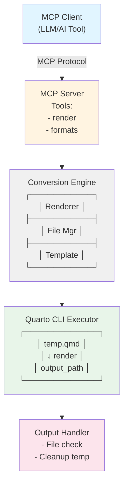

# Quarto MCP サーバー設計書

## 1. 概要

### 1.1 目的

Quarto Markdown（.qmd形式）を文字列として受け取り、PowerPoint（.pptx）形式を中心としたQuarto CLIがサポートする多様な出力形式に変換する MCP（Model Context Protocol）対応サーバーを設計・実装する。特にPowerPoint出力においては、カスタムテンプレートを利用した企業・組織固有のデザイン適用を可能にする。

### 1.2 主要機能

本サーバーは以下の機能を提供する：

- **PowerPoint形式を主軸**: 企業プレゼンテーション作成を最優先ユースケースとして設計
- **カスタムテンプレート対応**: PowerPointの企業テンプレート（.pptx）を指定可能
  - 設定ファイルで複数テンプレートを事前登録
  - ツール引数でテンプレートIDまたはURLを指定
  - URL指定時は自動ダウンロードして使用
- **文字列ベースの入力**: LLM/MCPクライアントから純粋な文字列として Quarto Markdown を受理
- **多形式出力対応**: PowerPoint以外にもQuarto CLIがサポートする全形式に対応
- **ファイルパス出力**: 指定されたパスに直接出力ファイルを生成
- **静的変換のみ**: セキュリティ確保のため、コードセル実行は行わない（`--no-execute`固定）
- **エラーハンドリング**: 詳細なエラー情報の提供

### 1.3 設計原則

- **再現性**: 同じ入力に対して常に同じ出力を生成
- **分離性**: 各変換ジョブは独立した環境で実行
- **拡張性**: 新しい出力形式の追加が容易な設計

---

## 2. Quarto 出力形式

### 2.1 サポート対象形式

Quarto CLIは以下の出力形式をサポートする。本サーバーは全形式に対応するが、特にPowerPoint形式を重点的にサポートする：

#### プレゼンテーション形式（推奨）
| 形式ID | 説明 | 拡張子 | 用途 |
|--------|------|--------|------|
| `html` | HTML5 ドキュメント | `.html` | Webページ、技術文書 |
| `pdf` | PDF (via LaTeX) | `.pdf` | 印刷用、論文、レポート |
| `docx` | Microsoft Word | `.docx` | 編集可能な文書 |
| `odt` | OpenDocument Text | `.odt` | オープンソース文書 |
| `epub` | 電子書籍形式 | `.epub` | 電子書籍出版 |
| `typst` | Typst組版システム | `.pdf` | 高速PDF生成 |

| 形式ID | 説明 | 拡張子 | 用途 | カスタムテンプレート |
|--------|------|--------|------|------------------|
| `pptx` | **PowerPoint** | `.pptx` | **企業プレゼン、編集可能な資料（最優先）** | **対応（reference-doc）** |
| `revealjs` | Reveal.js HTMLプレゼン | `.html` | インタラクティブプレゼン | 対応（CSS/テーマ） |
| `beamer` | LaTeX Beamer | `.pdf` | 学術プレゼンテーション | 対応（LaTeXテンプレート） |

#### ドキュメント形式

#### Markdown形式
| 形式ID | 説明 | 拡張子 | 用途 |
|--------|------|--------|------|
| `gfm` | GitHub Flavored Markdown | `.md` | GitHub/GitLab文書 |
| `commonmark` | CommonMark標準 | `.md` | 標準的なMarkdown |
| `hugo` | Hugo静的サイト | `.md` | Hugoサイト生成 |
| `docusaurus` | Docusaurusドキュメント | `.md` | ドキュメントサイト |
| `markua` | Markua (Leanpub) | `.md` | 電子書籍執筆 |

#### Wiki形式
| 形式ID | 説明 | 拡張子 | 用途 |
|--------|------|--------|------|
| `mediawiki` | MediaWiki | `.wiki` | Wikipedia形式 |
| `dokuwiki` | DokuWiki | `.txt` | DokuWikiサイト |
| `zimwiki` | Zim Wiki | `.txt` | Zimデスクトップwiki |
| `jira` | Jira Wiki | `.txt` | Atlassian Jira |
| `xwiki` | XWiki | `.txt` | XWikiシステム |

#### その他形式
| 形式ID | 説明 | 拡張子 | 用途 |
|--------|------|--------|------|
| `jats` | JATS XML (学術誌) | `.xml` | 学術論文出版 |
| `ipynb` | Jupyter Notebook | `.ipynb` | データサイエンス |
| `rtf` | Rich Text Format | `.rtf` | クロスプラットフォーム |
| `rst` | reStructuredText | `.rst` | Python/Sphinx文書 |
| `asciidoc` | AsciiDoc | `.adoc` | 技術文書 |
| `org` | Emacs Org-Mode | `.org` | Emacsドキュメント |
| `context` | ConTeXt | `.tex` | 高度な組版 |
| `texinfo` | GNU Texinfo | `.texi` | GNUドキュメント |
| `man` | Groff man page | `.man` | UNIXマニュアル |

### 2.2 Quarto CLI コマンド仕様

基本的な変換コマンド構文：

```bash
quarto render <input.qmd> --to <format> [options]
```

#### 主要オプション
- `--to <format>`: 出力形式を指定（必須）
- `--output <file>`: 出力ファイル名を指定
- `--output-dir <dir>`: 出力ディレクトリを指定
- `--execute`: コードセルを実行（デフォルト: true）
- `--no-execute`: コードセルを実行しない
- `--execute-daemon`: 永続的なデーモンプロセスで実行
- `--execute-daemon-restart`: デーモンを再起動して実行

#### 実行例

```bash
# HTML生成
quarto render document.qmd --to html

# PDF生成（コード実行なし）
quarto render document.qmd --to pdf --no-execute

# PowerPoint生成（出力先指定）
quarto render document.qmd --to pptx --output-dir ./output

# 複数形式同時生成（YAMLで指定）
quarto render document.qmd
```

---

## 3. システムアーキテクチャ

### 3.1 論理構成



### 3.2 コンポーネント詳細

#### 3.2.1 MCP Server
- **役割**: MCPプロトコルの実装、ツール公開、リクエスト処理
- **言語**: Python
- **フレームワーク**: `mcp` SDK
- **責務**:
  - MCPツールの定義と登録
  - Conversion Engineの呼び出し
  - エラーハンドリングとレスポンス生成

#### 3.2.2 Conversion Engine
- **役割**: Quarto変換処理のコア実装
- **責務**:
  - 一時ファイルシステムの管理
  - Quarto CLIの呼び出し（出力先パス指定）
  - 出力ファイルの存在確認と検証

#### 3.2.3 File Manager
- **役割**: 一時ファイル/ディレクトリの安全な管理
- **実装**: `tempfile` モジュール（Python）等
- **責務**:
  - 隔離されたtempディレクトリ作成
  - .qmdファイル書き込み
  - 変換後のクリーンアップ
  - タイムアウト時の強制削除

#### 3.2.4 Quarto CLI Executor
- **役割**: Quarto CLIの実行とプロセス管理
- **実装**: `subprocess` / `asyncio.create_subprocess_exec`
- **責務**:
  - コマンドライン引数の構築
  - プロセス起動と監視
  - stdout/stderrのキャプチャ
  - タイムアウト制御

---

## 4. MCP ツール定義

### 4.1 `quarto_render` ツール

**目的**: Quarto Markdownを指定形式に変換

#### 入力パラメータ

**content（必須）**
- データ型: 文字列
- 説明: Quarto Markdown形式（.qmd相当）の文字列

**format（必須）**
- データ型: 文字列（列挙型）
- 説明: 出力形式を指定
- 許可値: `pptx`, `html`, `pdf`, `docx`, `revealjs`, `beamer`, `gfm`, `commonmark`, `epub`, `jats`, `ipynb`, `rtf`, `rst`, `asciidoc`, `org`, `mediawiki`, `dokuwiki`, `zimwiki`, `jira`, `xwiki`, `context`, `texinfo`, `man`
- 推奨: `pptx`（PowerPoint）を最優先

**output_path（必須）**
- データ型: 文字列
- 説明: 出力ファイルを生成する絶対パス

**template（任意）**
- データ型: 文字列
- 説明: PowerPoint形式でのカスタムテンプレート指定
- 指定方法（以下のいずれか）:
  - **テンプレートID**: 設定ファイル（templates.yaml）で事前登録したテンプレート名を指定
    - 例: `"corporate_standard"`, `"sales_pitch"`, `"technical_report"`
  - **URL（HTTP/HTTPS）**: テンプレートファイル（.pptx）のURLを直接指定
    - 例: `"https://example.com/templates/custom.pptx"`
    - サーバーが自動的にダウンロードしてキャッシュ
    - HTTPSの使用を強く推奨（セキュリティ確保のため）
- 適用条件: `format`が`pptx`の場合のみ有効
- デフォルト: なし（Quartoのデフォルトテンプレート使用）
- 注意事項:
  - テンプレートIDを指定した場合、サーバー側の設定ファイルで定義されたパスに解決される
  - URLを指定した場合、一時ディレクトリにダウンロードされ、処理後に削除される
  - URL指定時はダウンロードタイムアウト（30秒）とファイルサイズ制限（50MB）あり

**format_options（任意）**
- データ型: オブジェクト
- 説明: 出力形式固有のオプション設定（Quarto YAMLヘッダー相当）
- デフォルト: 空オブジェクト
- 主な設定項目:
  - `toc`: 目次を生成するか（真偽値）
  - `number-sections`: セクション番号を付与するか（真偽値）
  - `theme`: テーマ名（文字列、形式により異なる）
  - `highlight-style`: コードハイライトスタイル（文字列）
  - `slide-level`: スライド分割レベル（整数、pptx/revealjs等で使用）
  - その他、形式依存の詳細オプション

#### 出力形式

**成功時のレスポンス**

- `success`: 真偽値、常に`true`
- `format`: 文字列、使用した出力形式ID
- `output`: オブジェクト、出力ファイル情報
  - `path`: 文字列、生成された出力ファイルの絶対パス
  - `filename`: 文字列、ファイル名のみ
  - `mime_type`: 文字列、MIMEタイプ（例: `application/pdf`, `text/html`）
  - `size_bytes`: 整数、ファイルサイズ（バイト単位）
- `metadata`: オブジェクト、変換メタデータ
  - `quarto_version`: 文字列、使用したQuarto CLIのバージョン
  - `render_time_ms`: 整数、変換処理時間（ミリ秒）
  - `warnings`: 配列、警告メッセージのリスト（空の場合もある）

#### エラーレスポンス

**失敗時のレスポンス**

- `success`: 真偽値、常に`false`
- `error`: オブジェクト、エラー詳細情報
  - `code`: 文字列、エラーコード（INVALID_INPUT, UNSUPPORTED_FORMAT, RENDER_FAILED, TIMEOUT, DEPENDENCY_MISSING, OUTPUT_NOT_FOUND）
  - `message`: 文字列、エラーの概要メッセージ
  - `details`: 文字列、エラーの詳細説明（ユーザー向け解決策を含む）
  - `quarto_output`: 文字列、Quarto CLIの標準エラー出力内容
  - `timestamp`: 文字列、エラー発生日時（ISO 8601形式）

## 5. 実装仕様

### 5.1 ディレクトリ構造

```
quarto-mcp-server/
├── src/
│   ├── __init__.py
│   ├── server.py          # MCPサーバーエントリポイント
│   ├── tools/
│   │   ├── __init__.py
│   │   ├── render.py      # quarto_render実装
│   │   └── formats.py     # quarto_list_formats実装
│   ├── core/
│   │   ├── __init__.py
│   │   ├── renderer.py    # Quarto CLI実行ロジック
│   │   ├── file_manager.py # 一時ファイル管理
│   │   └── template_manager.py # テンプレート管理
│   └── models/
│       ├── __init__.py
│       ├── formats.py     # 形式定義データ
│       └── schemas.py     # 入出力スキーマ
├── config/
│   └── templates.yaml     # PowerPointテンプレート設定
├── templates/
│   ├── corporate_standard.pptx
│   ├── sales_pitch.pptx
│   └── technical_report.pptx
├── tests/
│   ├── test_render.py
│   ├── test_templates.py
│   └── fixtures/
│       ├── sample.qmd
│       └── test_template.pptx
├── Dockerfile
├── pyproject.toml
├── README.md
└── LICENSE
```

### 5.2 pyproject.toml設定

**パッケージメタデータ**

projectセクションに以下の情報を定義:
- `name`: パッケージ名（`quarto-mcp-server`）
- `version`: バージョン番号（セマンティックバージョニング）
- `description`: プロジェクトの簡潔な説明文
- `readme`: README.mdファイルのパス指定
- `requires-python`: Python最低バージョン（`>=3.10`）
- `license`: ライセンス識別子（`CC-BY-4.0`）
- `authors`: 作者情報（名前とメールアドレス）
- `keywords`: 検索用キーワードリスト（`mcp`, `quarto`, `markdown`, `powerpoint`等）
- `classifiers`: PyPI分類子リスト（開発状況、対象ユーザー、ライセンス、Python版等）

**依存関係定義**

dependenciesセクションに必須パッケージを列挙:
- `mcp>=0.9.0`: MCP SDK
- `pydantic>=2.0.0`: データスキーマ
- `pyyaml`: YAML設定読み込み
- `httpx`: 非同期HTTPクライアント（テンプレートURLダウンロード用）

**CLIエントリーポイント**

project.scriptsセクションにコマンドラインエントリーポイントを定義:
- コマンド名: `quarto-mcp`
- モジュールパス: `src.server:main`
- 実行時に`src.server.py`の`main()`関数が呼び出される
- このエントリーポイントによりuvxや通常のインストール後に`quarto-mcp`コマンドで起動可能

**ビルドシステム設定**

build-systemセクションの設定:
- `requires`: ビルドに必要なツール（`hatchling`推奨）
- `build-backend`: ビルドバックエンド指定（`hatchling.build`）

**オプション設定**

tool.hatchセクション（使用する場合）:
- `packages`: パッケージディレクトリ指定（`["src"]`）
- 開発依存関係、テストツール設定等

### 5.3 主要クラス設計

#### QuartoRenderer クラス

**責務**: Quarto CLIを使用した変換処理の実装

**属性**
- `quarto_path`: Quarto CLI実行ファイルのパス（デフォルト: "quarto"）
- `temp_manager`: TempFileManagerインスタンス

**メソッド: render**

入力:
- `content`: 変換対象のQuarto Markdown文字列
- `format`: 出力形式ID
- `output_path`: 出力ファイルの絶対パス
- `template`: PowerPointテンプレート指定（任意、pptx形式時のみ有効）
- `format_options`: 形式固有オプション（任意）

処理フロー:
1. TempFileManagerを使用して一時ディレクトリを作成
2. PowerPoint形式の場合、TemplateManagerでテンプレートパスを解決:
   - `template`がテンプレートIDの場合、設定ファイルからパスを取得
   - `template`がURL（http://またはhttps://で始まる）の場合、以下を実行:
     1. URL形式の検証（スキーム、ドメイン、拡張子チェック）
     2. HTTPクライアント（httpx）で非同期ダウンロード
     3. 一時ディレクトリ内に保存（ファイル名は元のファイル名を保持）
     4. ダウンロードしたファイルのパスを返却
   - `template`が未指定の場合、テンプレート指定なし
3. 一時ディレクトリ内に`document.qmd`ファイルを作成
4. `content`とYAMLヘッダー（format_options + テンプレート指定から生成）を結合して.qmdファイルに書き込み
   - **YAMLヘッダー競合時の処理方針（マージ方式・APIパラメータ優先）**:
     - 入力`content`に既存のYAMLヘッダー（`---`で囲まれた部分）がある場合:
       1. 既存YAMLを解析してベースとする
       2. `format_options`の内容で既存YAMLを上書き・追加
       3. `template`パラメータがあれば`reference-doc`キーを追加（既存値を上書き）
     - 入力`content`にYAMLヘッダーがない場合:
       1. `format_options`と`template`から新規YAMLヘッダーを生成
   - PowerPointでテンプレート指定がある場合、YAMLに`reference-doc: <template_path>`を追加
   - この方針により、コンテンツ内の既存設定を活かしつつ、MCPツール呼び出し側の意図を最終的に反映
5. Quarto CLIコマンドを構築:
   - `quarto render <temp_qmd_path> --to <format> --output <output_path> --no-execute`
6. 非同期でQuarto CLIプロセスを起動し、完了を待機
7. プロセスの標準出力/標準エラー出力をキャプチャ
8. 出力ファイルの存在を確認（存在しない場合はエラー）
9. 出力ファイルの情報（パス、サイズ、MIMEタイプ）を取得
10. 一時ディレクトリをクリーンアップ（contextマネージャーで自動実行）
11. 変換結果をRenderResultオブジェクトとして返却

例外:
- `QuartoRenderError`: 変換処理が失敗した場合（プロセス非ゼロ終了、タイムアウト、出力ファイル未生成等）

**内部メソッド**

- `_write_qmd`: .qmdファイルへの書き込み処理
  - YAMLヘッダーの生成と埋め込み:
    - 入力コンテンツから既存YAMLヘッダーを抽出（存在する場合）
    - 既存YAMLと`format_options`をマージ（`format_options`が優先）
    - `template`パラメータがあれば`reference-doc`を追加/上書き
    - マージ後のYAMLヘッダーとコンテンツ本文を結合
  - UTF-8エンコーディングでの保存
  
- `_build_command`: Quarto CLIコマンドライン引数の構築
  - `--no-execute`オプションを必ず含める
  - `--output`で出力先を明示的に指定
  - タイムアウト設定（60秒）
  
- `_execute_quarto`: 非同期プロセス実行
  - `asyncio.create_subprocess_exec`を使用
  - stdout/stderrのキャプチャ
  - タイムアウト制御
  
- `_get_file_info`: 出力ファイルの情報取得
  - ファイルサイズの計算
  - 拡張子から MIMEタイプの推定

#### TemplateManager クラス

**責務**: PowerPointテンプレートの管理と解決

**属性**
- `config_path`: テンプレート設定ファイル（templates.yaml）のパス
- `templates`: 登録済みテンプレート情報の辞書（ID → パス）
- `http_client`: HTTPクライアント（httpx.AsyncClient）インスタンス
- `download_timeout`: URLダウンロードのタイムアウト秒数（デフォルト: 30秒）
- `max_download_size`: ダウンロード可能な最大ファイルサイズ（デフォルト: 50MB）

**メソッド: resolve_template**

入力:
- `template_spec`: テンプレート指定（IDまたはURL）
- `format`: 出力形式（pptx等）
- `temp_dir`: 一時ディレクトリパス（URL時のダウンロード先）

処理:
1. `format`が`pptx`以外の場合、Noneを返却（テンプレート不要）
2. `template_spec`が未指定（None）の場合、Noneを返却（デフォルトテンプレート使用）
3. `template_spec`がテンプレートID（設定ファイルに存在）の場合:
   - 設定ファイルから対応するパスを取得
   - パスの存在を確認
4. `template_spec`がURL（http://またはhttps://で始まる）の場合:
   - URLスキームの検証（HTTP/HTTPSのみ許可）
   - URLパスの拡張子を確認（.pptxのみ許可）
   - httpx.AsyncClientで非同期GET リクエスト実行
   - Content-Lengthヘッダーでサイズチェック（max_download_size以内）
   - ストリーミングダウンロードでファイルサイズを監視
   - temp_dir内にファイル保存（ファイル名はURLから抽出）
   - ダウンロード完了後のファイルパスを返却
5. 解決されたテンプレートパスを返却

出力:
- 解決されたテンプレートファイルの絶対パス（文字列）、またはNone

例外:
- `TemplateNotFoundError`: 指定されたテンプレートIDが存在しない
- `TemplateDownloadError`: URLからのダウンロード失敗
- `TemplateDownloadTimeoutError`: ダウンロードタイムアウト
- `TemplateSizeExceededError`: ファイルサイズが制限超過
- `InvalidTemplateUrlError`: 不正なURL（スキーム、ドメイン、拡張子等）
- `InvalidTemplateError`: テンプレートファイルが不正

**設定ファイル形式（templates.yaml）**

```yaml
templates:
  corporate_standard:
    path: /app/templates/corporate_standard.pptx
    description: "企業標準テンプレート"
  sales_pitch:
    path: /app/templates/sales_pitch.pptx
    description: "営業プレゼン用テンプレート"
  technical_report:
    path: /app/templates/technical_report.pptx
    description: "技術報告書テンプレート"
```

各テンプレート定義:
- `path`: テンプレートファイルの絶対パス（必須）
- `description`: テンプレートの説明（任意、ドキュメント用）

#### TempFileManager クラス

**責務**: 一時ファイルとディレクトリの安全な管理

**メソッド: create_workspace**

動作:
- コンテキストマネージャーとして実装（withステートメントで使用）
- 一時ディレクトリを作成（プレフィックス: "quarto_mcp_"）
- システムのtempディレクトリ配下に配置
- ディレクトリパスをPathオブジェクトとしてyield
- コンテキスト終了時（正常終了・例外問わず）、ディレクトリを再帰的に削除
- 削除時のエラーは無視（ignore_errors=True）

セキュリティ考慮:
- ディレクトリ名にランダムサフィックスを含めることで衝突を回避
- 他のプロセスからアクセスできないよう適切なパーミッション設定
- プロセス終了時に必ずクリーンアップを実行

### 5.4 エラーハンドリング

#### エラー分類

| エラーコード | 説明 | HTTPステータス相当 |
|-------------|------|-------------------|
| `INVALID_INPUT` | 入力Markdownの構文エラー | 400 |
| `UNSUPPORTED_FORMAT` | 未サポートの出力形式 | 400 |
| `RENDER_FAILED` | Quarto CLIの実行失敗 | 500 |
| `TIMEOUT` | 変換タイムアウト | 504 |
| `DEPENDENCY_MISSING` | 必要な依存ソフトウェア不足 | 500 |
| `OUTPUT_NOT_FOUND` | 出力ファイルが見つからない | 500 |

#### エラーレスポンス形式

**失敗時のレスポンス構造**

- `success`: 真偽値、常に`false`
- `error`: オブジェクト、エラー詳細情報
  - `code`: 文字列、エラーコード（上記のエラー分類表を参照）
  - `message`: 文字列、エラーの概要メッセージ
  - `details`: 文字列、エラーの詳細説明（ユーザー向け解決策を含む）
  - `quarto_stderr`: 文字列、Quarto CLIの標準エラー出力内容（デバッグ用）
  - `timestamp`: 文字列、エラー発生日時（ISO 8601形式）

例: PDF生成時にpdflatexが見つからない場合、`code`は`RENDER_FAILED`、`message`には「PDF generation failed: pdflatex not found」、`details`には「Please install TeX Live or TinyTeX」などの解決策が含まれる。

## 6. 前提条件・依存関係

### 6.1 システム要件

- **OS**: Linux / macOS / Windows
- **Python**: 3.10 以上
- **Quarto CLI**: 1.3 以上（推奨: 最新版）

### 6.2 必須依存ソフトウェア

| ソフトウェア | 目的 | インストール方法 |
|------------|------|----------------|
| Quarto CLI | コア変換エンジン | https://quarto.org/docs/get-started/ |
| Python 3.10+ | MCPサーバー実装 | 公式サイト / パッケージマネージャー |
| PowerPointテンプレート | カスタムデザイン適用 | 企業・組織が用意（.pptx形式） |

### 6.3 形式別追加要件

| 出力形式 | 追加要件 | インストール方法 |
|---------|---------|----------------|
| PDF | TeX Live / TinyTeX | `quarto install tinytex` |
| Typst | Typst CLI | https://github.com/typst/typst` |

**注**: 
- コードセル実行を行わないため、Jupyter/IPythonカーネルは不要
- PowerPointテンプレートは、Quartoが認識可能な標準的な.pptxファイルであれば使用可能
- テンプレートには、マスタースライド、フォント設定、配色設定等が含まれる

### 6.4 Python依存パッケージ

**必須パッケージ一覧**

プロジェクト設定ファイル（pyproject.toml）のdependenciesセクションに以下を記載:

1. **mcp** (バージョン 0.9.0以上)
   - Model Context Protocolの公式SDK
   - MCPサーバーの実装に必須
   - ツール定義、リクエスト/レスポンス処理を提供

2. **pydantic** (バージョン 2.0.0以上)
   - データスキーマ定義
   - 入出力パラメータの型安全性を確保
   - JSON SchemaとPythonクラス間の変換

3. **asyncio**
   - 非同期処理のサポート（Python標準ライブラリ）
   - Quarto CLIの非同期実行
   - 複数リクエストの並行処理

4. **PyYAML**
   - テンプレート設定ファイル（templates.yaml）の読み込み
   - YAMLフロントマターの解析・生成

5. **httpx**
   - 非同期HTTPクライアント機能
   - テンプレートURLからのダウンロード処理
   - タイムアウト制御とストリーミングダウンロード対応
   - HTTP/2サポートによる高速ダウンロード

---

## 7. テスト戦略

### 7.1 単体テスト
- 各MCPツールの個別機能テスト
- 全サポート形式の変換テスト
- エラーハンドリングのテスト

### 7.2 統合テスト
- MCP Client - Serverの通信テスト
- Quarto CLI との統合テスト

---

## 8. デプロイメント

### 8.1 推奨構成

**uvx実行環境（推奨）**

uvxを使用した最も簡単な実行方法:

必須環境:
- Python 3.10以上がシステムにインストール済み
- Quarto CLI 1.3以上がシステムにインストール済み
- uv（Pythonパッケージマネージャー）がインストール済み

実行方法:
1. **ローカルディレクトリから実行**: プロジェクトのルートディレクトリで`uvx --from . quarto-mcp`コマンドを実行
   - uvが自動的に仮想環境を作成
   - pyproject.tomlから依存関係を読み込んでインストール
   - scriptsエントリーポイントで定義された`quarto-mcp`コマンドを実行
   - 実行ごとに環境が隔離され、システムのPython環境を汚染しない

2. **Gitリポジトリから直接実行**: リポジトリURLを指定して`uvx --from git+https://github.com/user/quarto-mcp quarto-mcp`を実行
   - uvが自動的にリポジトリをクローン
   - 依存関係を解決してインストール
   - サーバーを起動

3. **PyPIから実行**（公開後）: パッケージ名を指定して`uvx quarto-mcp`コマンドを実行
   - PyPIから最新版をダウンロード
   - 自動で環境構築して実行

利点:
- システム環境へのインストール不要
- 依存関係の自動管理
- 常に最新版を実行可能
- 複数バージョンの並行実行が容易
- アンインストール不要（キャッシュのみ残る）

MCP設定ファイルへの統合:
- MCP設定ファイル（通常`~/.config/mcp/settings.json`等）でサーバー起動コマンドを`uvx`経由に指定
- 例: commandフィールドに`["uvx", "--from", ".", "quarto-mcp"]`を設定
- MCPクライアント起動時に自動的にuvx経由でサーバーが起動

**開発環境**

セットアップ手順:
1. uvを使用した開発モード: プロジェクトルートで`uv pip install -e .`を実行して開発モードでインストール
2. Quarto CLIの動作確認: `quarto check`コマンドを実行してインストール状態を確認
3. MCPサーバーを起動:
   - uvx経由: `uvx --from . quarto-mcp`
   - または直接: `python -m src.server`
   - または開発インストール後: `quarto-mcp`コマンド

動作確認:
- Quarto CLIが正しくインストールされていること（`quarto --version`で確認）
- Python依存パッケージが全てインストールされていること
- サーバーがMCPプロトコルで通信可能な状態であること
- 標準入出力を通じたJSON-RPC通信が機能すること

**pip/uv インストール環境**

パッケージとしてインストールする場合:
1. PyPIから: `pip install quarto-mcp-server`または`uv pip install quarto-mcp-server`
2. Gitから: `pip install git+https://github.com/user/quarto-mcp`または`uv pip install git+https://github.com/user/quarto-mcp`
3. ローカルから: プロジェクトルートで`pip install .`または`uv pip install .`

インストール後:
- `quarto-mcp`コマンドが実行可能になる
- システム全体またはvenv環境にインストールされる
- MCP設定ファイルでコマンドパスを指定して使用

**本番環境**

推奨構成:
- Dockerコンテナ化による環境の一貫性確保
- Kubernetesを用いた水平スケーリング対応
- ヘルスチェックエンドポイントの実装（liveness/readiness probe用）
- ログ出力の構造化（JSON形式推奨）
- メトリクス収集（Prometheus形式等）
- uvx経由での実行も可能（コンテナ内でuv環境を構築）

### 8.2 Dockerコンテナ構成

**ベースイメージ**
- Python 3.11 slim版を使用（軽量化のため）

**環境構築手順**
1. Quarto CLI のインストール:
   - 公式リリースページから最新のLinux amd64版DEBパッケージをダウンロード
   - dpkgでインストール
   - インストール後、パッケージファイルを削除してイメージサイズを削減

2. TinyTeX のインストール:
   - PDF出力対応のため、Quarto経由でTinyTeXをインストール
   - quarto install tinytex コマンドを実行
   - 完全なTeX Liveより軽量

3. Python依存関係のインストール:
   - requirements.txtから依存パッケージをインストール
   - キャッシュを残さない（--no-cache-dir）ことでイメージサイズを削減

4. アプリケーションの配置:
   - srcディレクトリ配下のソースコードをコンテナ内の/app/srcにコピー
   - 作業ディレクトリを/appに設定

5. 起動コマンドの設定:
   - python -m src.server でMCPサーバーを起動
   - CMDディレクティブで指定

